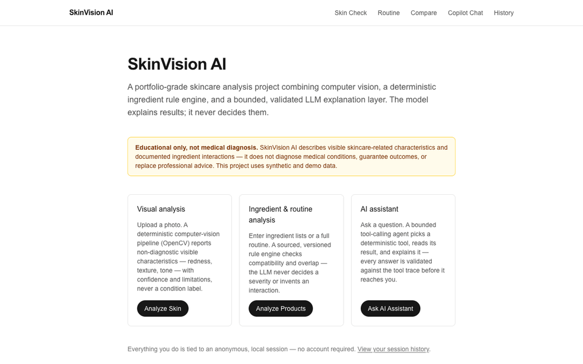
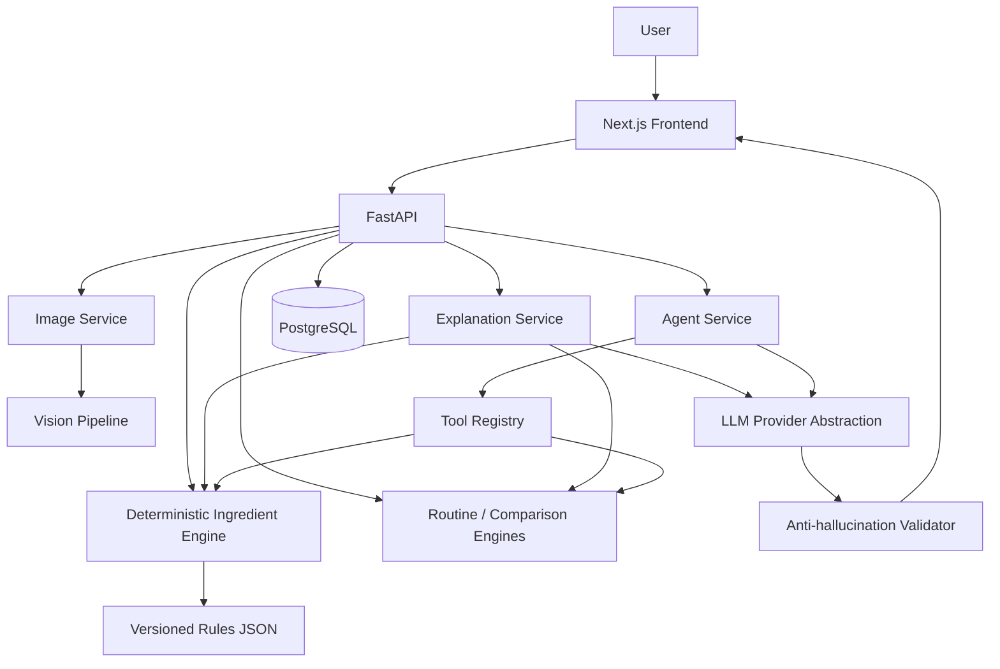

# SkinVision AI

An educational, portfolio-grade skincare analysis platform combining
computer vision, a deterministic ingredient/routine rule engine, and a
bounded, validated LLM explanation layer — built to demonstrate
full-stack AI engineering, not to diagnose anything.



*Live walkthrough of the running app — real, unscripted output from the
deterministic engines and the bounded agent (see [Setup](#setup) to run
it yourself).*

## Why this project exists

It demonstrates a pattern that matters beyond skincare: **combining a
deterministic system of record with a generative-AI layer that
explains and orchestrates but never decides.**

- Every LLM response is grounded in trusted, already-computed backend
  results — the model is never the source of truth for a fact, number,
  citation, or severity.
- A small, custom bounded tool-calling agent (no LangChain/LangGraph)
  selects among deterministic tools and is validated after the fact
  against exactly what those tools returned.
- A deterministic, post-hoc anti-hallucination/safety validator
  backstops prompt-level instructions rather than trusting them alone.
- A reproducible, offline evaluation harness measures the system's own
  behavior against version-controlled fixtures.
- A complete, working full-stack implementation: FastAPI + async
  SQLAlchemy + PostgreSQL + Next.js, containerized and tested end to end.

It is **not** medically accurate, clinically validated, or
production-ready — see [Limitations](#limitations) and
[Disclaimer](#disclaimer).

## What this is (and isn't)

SkinVision AI analyzes a skin photo, product ingredient lists, and a
skincare routine to produce **non-diagnostic, explainable insights** —
visible characteristics ("visible redness," "visible texture"),
ingredient compatibility notes, and routine ordering suggestions, each
traceable back to the deterministic rule or tool call that produced it.

**It is not a medical diagnostic tool.** It never identifies or claims
to detect a medical skin condition (acne, rosacea, eczema, melanoma,
etc.), and every analysis carries this disclaimer:

> SkinVision AI provides educational skincare insights, not medical
> diagnosis or medical advice.

All development and evaluation data is synthetic or generated locally —
no real user photos are stored in this repository.

## Key capabilities

| Capability | What it does |
|---|---|
| **Image quality gate** | Rejects a bad photo (resolution, blur, brightness, contrast) with a specific reason before any analysis runs |
| **Visual observations** | OpenCV pipeline reports redness, texture, shine, uneven tone, and spots/marks — each with a score and its exact computation method |
| **Ingredient analysis** | Parses/normalizes raw INCI text to canonical ingredients; surfaces ambiguous names honestly rather than guessing |
| **Ingredient compatibility** | A small, source-cited rule set (Cleveland Clinic, AAD) flags documented interactions — never a fabricated one |
| **Routine analysis** | Overlapping actives, cross-product compatibility, and a suggested AM/PM order (sunscreen-last exception) |
| **Product comparison** | Shared vs. unique ingredients and interactions between two products — deliberately no "better product" score |
| **AI explanations** | Plain-language narration of a deterministic result, validated after generation so it can't assert anything the result didn't establish |
| **Agentic chat** | A bounded agent picks from 5 deterministic tools, reads their real output, and answers only from that — with an inspectable trace |
| **Sessions & history** | Anonymous, no-login sessions; a History page surfaces past analyses, chats, routines, and comparisons |
| **Safety validation** | Rejects unsupported claims, fabricated citations/numbers, and diagnostic-sounding language before it reaches a user |
| **Evaluation harness** | 104 reproducible, offline cases across all 7 subsystems — a regression gate, not a one-off check |

## Architecture

The LLM is good at language, orchestration, and explanation — not at
being a reliable source of facts. So deterministic Python code (the
ingredient engine, routine analyzer, product comparator) makes every
rule-based decision from versioned, source-cited rule files the LLM
can't edit; the LLM only interprets requests, picks tools, and narrates
already-validated output. See [docs/llm.md](docs/llm.md),
[docs/agent.md](docs/agent.md), and [docs/ingredients.md](docs/ingredients.md).



The trust boundary — the LLM sits strictly *after* facts are
established, and its output is checked again before it reaches anyone:

```
User input → Deterministic engines (CV / ingredients / routine / comparison)
    → Trusted structured facts (Pydantic models, source-cited rule data)
    → LLM explanation / Agent (orchestrates + narrates only)
    → Post-hoc validation (anti-hallucination, diagnostic-claim, Unicode-normalized)
    → User-facing response
```

Full details: [docs/architecture.md](docs/architecture.md).

## Technology stack

**Backend:** Python 3.11, FastAPI, Pydantic v2, SQLAlchemy 2.0 (async) +
asyncpg, Alembic, PostgreSQL 16, OpenCV/Pillow/NumPy, pytest.

**AI / LLM:** `LLMProvider` abstraction (Anthropic + OpenAI-compatible,
swappable), native provider tool-calling, schema-constrained outputs
with no field for a severity/citation/number the LLM could set,
deterministic post-hoc validation, a small custom bounded agent loop
(no agent framework), and `FakeLLMProvider` so the full test/eval suite
runs without a live API key.

**Frontend:** Next.js 16 (App Router), React 19, TypeScript, Tailwind.

**Infrastructure:** Docker + Docker Compose — `db` (PostgreSQL 16),
`api` (FastAPI), `web` (Next.js), nothing else.

Every item above is actually present in `backend/requirements.txt`,
`backend/requirements-dev.txt`, or `frontend/package.json`.

## Safety boundary

- Never diagnoses a condition or claims medical certainty; uses
  non-diagnostic language throughout ("visible redness," not "rosacea").
- The agent's system prompt forbids diagnosis/prescription/certainty
  claims and redirects medical questions to a professional; every final
  answer is additionally validated after the fact, not trusted on the
  prompt alone (see [docs/agent.md](docs/agent.md)).
- The agent can only reference a severity, interaction, or citation an
  actual tool call returned — structurally guaranteed, since its raw
  output schema has no field for any of the three.
- No arbitrary code execution: tools are looked up by exact name in a
  fixed registry — never `eval`/`exec`/dynamic import.
- No real user images are stored in the repo. `IMAGE_RETENTION_MODE=none`
  analyzes fully in-memory; the default `temporary` mode writes the file
  with **no automatic deletion/TTL job** yet — see
  [docs/safety.md](docs/safety.md#upload-safety).
- Decompression-bomb protection rejects absurd declared image
  dimensions with a controlled 400 before any expensive pixel work.
- A global exception handler gives every unexpected error the same
  sanitized `{code, message}` shape — never a stack trace or internal path.
- No LLM/database credentials reach the frontend — the only
  `NEXT_PUBLIC_*` variable is the API base URL.
- Per-client-IP rate limiting (hand-rolled fixed-window, no dependency)
  on image upload and agent chat, the two endpoints with real per-request
  cost in an app with no authentication — see [docs/safety.md](docs/safety.md#rate-limiting).
- A tool handler's own exception is never returned to the client — it's
  logged server-side and replaced with a fixed, generic message.

## Evaluation

A reproducible, fully offline evaluation harness covering all 7
subsystems. Current results (`python -m evaluation`):

| Subsystem | Cases | Result |
|---|---|---|
| Vision | 15 | 15/15 |
| Ingredients | 28 | 28/28 |
| Routine | 10 | 10/10 |
| Comparison | 8 | 8/8 |
| LLM explanation | 9 | 9/9 |
| Agent | 19 | 19/19 |
| Safety | 15 | 15/15 |
| **Total** | **104** | **104/104** |

**These numbers demonstrate engineering correctness and regression
protection — not clinical or dermatological accuracy.** The vision
cases run against procedurally generated synthetic images with
controlled properties; they prove the pipeline behaves correctly and
deterministically, not that it's accurate against real skin. See
[docs/evaluation.md](docs/evaluation.md) for full methodology.

```bash
cd backend
pytest tests/evaluation/     # regression gate, part of the normal suite
python -m evaluation           # standalone run + JSON report
```

Fully offline: every LLM/agent case uses a deterministic
`FakeLLMProvider`, so no API key or network access is required.

## Testing

756 backend tests pass (real PostgreSQL, no ORM mocking, run inside
Docker) plus the 104 evaluation cases above — both offline-capable.

```bash
docker compose exec api pytest -q                  # full backend suite
docker compose exec api pytest tests/evaluation/    # evaluation suite only
docker compose exec api alembic check                # confirm no pending migrations
```

Frontend: `npx tsc --noEmit`, `npm run lint`, and `npm run build` all
pass with zero warnings.

## Setup

**Prerequisites:** Docker + Docker Compose, Node.js 20+ and Python
3.11+ (only needed for local dev outside Docker).

```bash
cp backend/.env.example backend/.env
docker compose up --build
```

- API: http://localhost:8010 (health check at `/health`)
- Web: http://localhost:3010

`NEXT_PUBLIC_API_BASE_URL` (the frontend's only config value) is inlined
into the client bundle at Docker **build** time, not read at container
start — `docker-compose.yml` passes it to `web` as a build arg. To point
a build at a different API URL: `NEXT_PUBLIC_API_BASE_URL=https://api.example.com
docker compose build web`. See [docs/architecture.md](docs/architecture.md#docker-deployment).

**Backend, locally:**

```bash
cd backend
python -m venv .venv && source .venv/bin/activate
pip install -r requirements-dev.txt
cp .env.example .env
pytest
uvicorn app.main:app --reload
```

`pytest` requires a reachable PostgreSQL matching `DATABASE_URL` (e.g.
`docker compose up -d db`, then `alembic upgrade head`) — tests exercise
the real database rather than mocking the ORM.

**Frontend, locally:**

```bash
cd frontend
npm install
cp .env.local.example .env.local
npm run dev -- --port 3010
```

## Development commands

```bash
# Backend
docker compose exec api pytest -q                     # full backend suite
docker compose exec api pytest tests/evaluation/       # evaluation suite only
docker compose exec api python -m evaluation             # evaluation + JSON report
docker compose exec api alembic check                     # no pending migrations
docker compose exec api alembic upgrade head                # apply migrations

# Frontend (from frontend/)
npx tsc --noEmit    # TypeScript
npm run lint          # ESLint
npm run build           # production build
```

## Repository layout

```
skinvision-ai/
├── backend/
│   ├── app/          FastAPI app: api/, services/, agent/, llm/, vision/, ingredients/,
│   │                    routine/, products/, models/, schemas/, core/
│   ├── alembic/        versioned database migrations
│   ├── evaluation/      offline evaluation harness — datasets/, runners/, metrics.py
│   ├── rules/           versioned, source-cited ingredient/routine rule JSON
│   ├── tests/           backend test suite (756 tests) + tests/evaluation/
│   └── datasets/        gitignored local fixture scaffold (no binary photos ever committed)
├── frontend/
│   └── src/
│       ├── app/          Next.js App Router pages (/, /analyze, /results/[id], /compare,
│       │                   /routine, /chat, /history)
│       ├── components/    shared UI (StatusBadge, ErrorState, EmptyState, Disclaimer, ...)
│       └── lib/           typed API client, session persistence
├── docs/              architecture, vision, ingredients, routine, llm, agent, safety, evaluation, ...
│   └── history/         superseded pre-implementation phase plans (reference only)
└── docker-compose.yml   db (Postgres 16) + api (FastAPI) + web (Next.js)
```

## Documentation

- [docs/architecture.md](docs/architecture.md) — system design
- [docs/vision.md](docs/vision.md) — computer vision pipeline
- [docs/ingredients.md](docs/ingredients.md) — deterministic ingredient engine
- [docs/routine.md](docs/routine.md) — routine analysis and product comparison
- [docs/llm.md](docs/llm.md) — LLM provider abstraction and explanation layer
- [docs/agent.md](docs/agent.md) — agent/tool-calling architecture
- [docs/persistence.md](docs/persistence.md) — sessions, database relationships, analysis/chat lifecycle
- [docs/api.md](docs/api.md) — API reference
- [docs/frontend.md](docs/frontend.md) — frontend structure, screens, shared components
- [docs/safety.md](docs/safety.md) — safety architecture, trust boundaries, known limitations
- [docs/evaluation.md](docs/evaluation.md) — evaluation harness: datasets, runners, metrics, offline execution
- [docs/phases.md](docs/phases.md) — build history, phase by phase
- [docs/history/](docs/history/) — superseded pre-implementation phase plans, kept for reference only
- [docs/resume-metrics.md](docs/resume-metrics.md) — every project metric with its source and how it was measured

## Limitations

This is a portfolio project, not a clinical tool:

- **No clinical or dermatological validation of any kind** — visual
  observations come from classical OpenCV heuristics calibrated against
  synthetic images, never real skin or a real medical outcome.
- **The evaluation harness proves engineering correctness and
  regression protection, not real-world accuracy.**
- **Visual observations are heuristic estimates**, affected by
  lighting, camera quality, makeup, and resolution; not tone-corrected;
  "apparent dryness" is never estimated at all (see [docs/vision.md](docs/vision.md)).
- **The ingredient rule set is intentionally small and curated** — 28
  canonical ingredients, 6 source-cited rules, not an exhaustive
  database. Anything not in the rule set is reported as unrecognized,
  never guessed.
- **Safety/anti-hallucination validators are heuristic** (regex and
  set-membership), deliberately biased toward over-rejection — see
  [docs/safety.md](docs/safety.md).
- **No authentication or accounts.** Sessions are anonymous UUIDs;
  possessing a session/analysis/chat id grants access to it — a
  disclosed, deliberate scope boundary.
- **No automatic image deletion/TTL job.** An image written under the
  default `temporary` retention mode stays until manually removed.
- **No real-world dermatological accuracy claim of any kind.**

## Future work

Deliberately not built, to keep scope honest and finished:

- Authentication and per-user accounts (the anonymous session model
  would need to change alongside it, not just gain a login screen).
- A genuinely sourced, licensed clinical/dermatological dataset —
  the only legitimate way to expand the evaluation claims beyond
  engineering correctness.
- Broader ingredient rule coverage, always additive to the existing
  versioned rule files.
- Improved/learned CV models as an optional supplement to the existing
  classical heuristics — never replacing the deterministic baseline.
- An automated image-retention/cleanup job.
- Cloud deployment, observability, and CI wiring for the existing
  offline-capable test/evaluation suites.

Nothing above is implemented in this repository or promised for a
specific timeline.

## Disclaimer

SkinVision AI is an educational and portfolio engineering project. It
is **not** a medical device, does not provide medical or
dermatological diagnosis, and is not a substitute for professional
care. It uses synthetic and demo data throughout development and
evaluation. If you have a medical or dermatological concern, consult a
qualified healthcare professional.

## Contributing

See [CONTRIBUTING.md](CONTRIBUTING.md) for local setup, how to run the
test/evaluation suites, and expectations for a change.

## License

[MIT](LICENSE)
