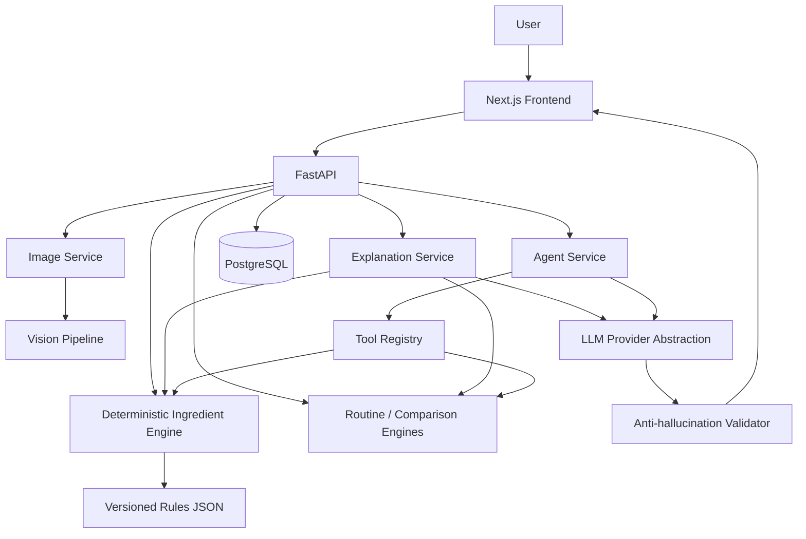

# SkinVision AI

An educational, portfolio-grade skincare analysis platform combining
computer vision, a deterministic ingredient/routine rule engine, and a
bounded, validated LLM explanation layer — built to demonstrate
full-stack AI engineering, not to diagnose anything.


*Live walkthrough of the running app — real, unscripted output from the
deterministic engines and the bounded agent (see [Setup](#setup) to run
it yourself).*

## Why this project exists

It demonstrates a pattern that matters beyond skincare: **combining a
deterministic system of record with a generative-AI layer that
explains and orchestrates but never decides.**

- Every LLM response is grounded in already-computed backend results —
  the model is never the source of truth for a fact, number, citation,
  or severity.
- A small, custom bounded tool-calling agent (no LangChain/LangGraph)
  selects deterministic tools and is validated after the fact against
  exactly what those tools returned.
- A reproducible, offline evaluation harness (104 cases) and a
  756-test backend suite guard the whole system, not just the UI.

It is **not** medically accurate, clinically validated, or
production-ready — see [Limitations](#limitations) and
[Disclaimer](#disclaimer).

## What this is (and isn't)

SkinVision AI analyzes a skin photo, product ingredient lists, and a
skincare routine to produce **non-diagnostic, explainable insights** —
visible characteristics ("visible redness," "visible texture"),
ingredient compatibility notes, and routine ordering suggestions, each
traceable back to the deterministic rule or tool call that produced it.

**It is not a medical diagnostic tool** — it never identifies or
claims to detect a medical skin condition, and every analysis carries
this disclaimer:

> SkinVision AI provides educational skincare insights, not medical
> diagnosis or medical advice.

All development/evaluation data is synthetic or generated locally — no
real user photos are stored in this repository.

## Key capabilities

| Capability | What it does |
|---|---|
| **Image quality gate** | Rejects a bad photo (resolution, blur, brightness, contrast) with a specific reason before any analysis runs |
| **Visual observations** | OpenCV pipeline reports redness, texture, shine, uneven tone, and spots/marks — each with a score and its exact computation method |
| **Ingredient analysis** | Parses/normalizes raw INCI text to canonical ingredients; surfaces ambiguous names honestly rather than guessing |
| **Ingredient compatibility** | A small, source-cited rule set (Cleveland Clinic, AAD) flags documented interactions — never a fabricated one |
| **Routine analysis** | Overlapping actives, cross-product compatibility, and a suggested AM/PM order (sunscreen-last exception) |
| **Product comparison** | Shared vs. unique ingredients and interactions between two products — deliberately no "better product" score |
| **AI explanations** | Plain-language narration of a deterministic result, validated after generation so it can't assert anything the result didn't establish |
| **Agentic chat** | A bounded agent picks from 5 deterministic tools, reads their real output, and answers only from that — with an inspectable trace |
| **Sessions & history** | Anonymous, no-login sessions; a History page surfaces past analyses, chats, routines, and comparisons |
| **Safety validation** | Rejects unsupported claims, fabricated citations/numbers, and diagnostic-sounding language before it reaches a user |
| **Evaluation harness** | 104 reproducible, offline cases across all 7 subsystems — a regression gate, not a one-off check |

## Architecture

The LLM is good at language, orchestration, and explanation — not at
being a reliable source of facts. Deterministic Python code (the
ingredient engine, routine analyzer, product comparator) makes every
rule-based decision from versioned, source-cited rule files the LLM
can't edit; the LLM only interprets requests, picks tools, and narrates
already-validated output. See [docs/llm.md](docs/llm.md),
[docs/agent.md](docs/agent.md), and [docs/ingredients.md](docs/ingredients.md).



The trust boundary — the LLM sits strictly *after* facts are
established, and its output is checked again before it reaches anyone:

```
User input → Deterministic engines → Trusted structured facts
    → LLM explanation / Agent (orchestrates + narrates only)
    → Post-hoc validation (anti-hallucination, diagnostic-claim)
    → User-facing response
```

Full details: [docs/architecture.md](docs/architecture.md).

## Technology stack

- **Backend:** Python 3.11, FastAPI, Pydantic v2, SQLAlchemy 2.0 (async) + asyncpg, Alembic, PostgreSQL 16, OpenCV/Pillow/NumPy, pytest
- **AI/LLM:** `LLMProvider` abstraction (Anthropic + OpenAI-compatible), native tool-calling, schema-constrained outputs, a small custom bounded agent loop, and `FakeLLMProvider` so the full test/eval suite runs offline
- **Frontend:** Next.js 16 (App Router), React 19, TypeScript, Tailwind
- **Infrastructure:** Docker Compose — `db` (PostgreSQL), `api` (FastAPI), `web` (Next.js), nothing else

Every item above is actually present in `backend/requirements.txt` or `frontend/package.json`.

## Safety boundary

- Never diagnoses a condition; uses non-diagnostic language throughout
  ("visible redness," not "rosacea") — every claim validated after
  generation, not just prompted for.
- The agent can only reference a severity, interaction, or citation an
  actual tool call returned — structurally guaranteed by its output
  schema. No arbitrary code execution: tools are looked up by exact
  name in a fixed registry.
- No real user images are stored in the repo; no LLM/database
  credentials reach the frontend; a global exception handler sanitizes
  every error response.
- Per-client-IP rate limiting on the two cost-bearing endpoints (image
  upload, agent chat) in an app with no authentication.

Full detail, including the upload/retention and rate-limiting specifics: [docs/safety.md](docs/safety.md).

## Evaluation

A reproducible, fully offline evaluation harness covering all 7
subsystems. Current results (`python -m evaluation`):

| Subsystem | Cases | Result |
|---|---|---|
| Vision | 15 | 15/15 |
| Ingredients | 28 | 28/28 |
| Routine | 10 | 10/10 |
| Comparison | 8 | 8/8 |
| LLM explanation | 9 | 9/9 |
| Agent | 19 | 19/19 |
| Safety | 15 | 15/15 |
| **Total** | **104** | **104/104** |

**These numbers demonstrate engineering correctness and regression
protection — not clinical or dermatological accuracy** (the vision
cases run against procedurally generated synthetic images). See
[docs/evaluation.md](docs/evaluation.md) for full methodology.

```bash
cd backend
pytest tests/evaluation/     # regression gate, part of the normal suite
python -m evaluation           # standalone run + JSON report
```

Fully offline: every LLM/agent case uses a deterministic `FakeLLMProvider`.

## Testing

756 backend tests pass (real PostgreSQL, no ORM mocking, run inside
Docker) plus the 104 evaluation cases above — both offline-capable.
Frontend: `tsc --noEmit`, `eslint`, and `next build` all pass with zero
warnings. Full commands: [CONTRIBUTING.md](CONTRIBUTING.md).

## Setup

**Prerequisites:** Docker + Docker Compose.

```bash
cp backend/.env.example backend/.env
docker compose up --build
```

- API: http://localhost:8010 (health check at `/health`)
- Web: http://localhost:3010

`NEXT_PUBLIC_API_BASE_URL` is inlined at Docker **build** time (not
read at container start) — see
[docs/architecture.md](docs/architecture.md#docker-deployment) to point
a build at a different API URL. For local (non-Docker) backend/frontend
dev and every other dev command, see [CONTRIBUTING.md](CONTRIBUTING.md).

## Repository layout

```
skinvision-ai/
├── backend/app/       FastAPI app: api/, services/, agent/, llm/, vision/, ingredients/, routine/, ...
├── backend/rules/     versioned, source-cited ingredient/routine rule JSON
├── backend/tests/     756 tests + tests/evaluation/
├── backend/evaluation/  offline evaluation harness
├── frontend/src/app/  Next.js pages (/, /analyze, /results/[id], /compare, /routine, /chat, /history)
├── docs/              architecture, vision, ingredients, routine, llm, agent, safety, evaluation, ...
└── docker-compose.yml   db (Postgres 16) + api (FastAPI) + web (Next.js)
```

## Documentation

- [docs/architecture.md](docs/architecture.md) — system design
- [docs/agent.md](docs/agent.md) — agent/tool-calling architecture, incl. a runbook for adding a tool
- [docs/llm.md](docs/llm.md) · [docs/vision.md](docs/vision.md) · [docs/ingredients.md](docs/ingredients.md) · [docs/routine.md](docs/routine.md) — core engines
- [docs/safety.md](docs/safety.md) — safety architecture and known limitations
- [docs/evaluation.md](docs/evaluation.md) — evaluation harness, incl. how to add/maintain a case
- [docs/api.md](docs/api.md) · [docs/persistence.md](docs/persistence.md) · [docs/frontend.md](docs/frontend.md) — API reference, data model, frontend structure
- [docs/resume-metrics.md](docs/resume-metrics.md) — every project metric with its source and how it was measured
- [docs/phases.md](docs/phases.md) / [docs/history/](docs/history/) — build history and superseded planning docs

## Limitations

This is a portfolio project, not a clinical tool:

- **No clinical or dermatological validation of any kind** — visual
  observations come from classical OpenCV heuristics, never real skin
  or a real medical outcome.
- **The evaluation harness proves engineering correctness, not
  real-world accuracy.**
- **The ingredient rule set is intentionally small** — 28 canonical ingredients,
  6 source-cited rules. Anything else is reported as unrecognized, never guessed.
- **Safety validators are heuristic**, biased toward over-rejection.
- **No authentication.** Sessions are anonymous UUIDs; possessing an
  id grants access — a disclosed, deliberate scope boundary.
- **No automatic image deletion/TTL job** yet.

Full detail: [docs/safety.md](docs/safety.md), [docs/vision.md](docs/vision.md).

## Future work

Deliberately not built, to keep scope honest and finished: authentication/accounts, a genuinely sourced clinical dataset, broader ingredient coverage, learned CV models as an optional supplement (never replacing the deterministic baseline), automated image retention, and cloud/CI deployment. Nothing above is implemented here or promised for a timeline.

## Disclaimer

SkinVision AI is an educational and portfolio engineering project. It
is **not** a medical device, does not provide medical or
dermatological diagnosis, and is not a substitute for professional
care. It uses synthetic and demo data throughout development and
evaluation. If you have a medical or dermatological concern, consult a
qualified healthcare professional.

## Contributing

See [CONTRIBUTING.md](CONTRIBUTING.md) for local setup, dev commands, and expectations for a change.

## License

[MIT](LICENSE)
