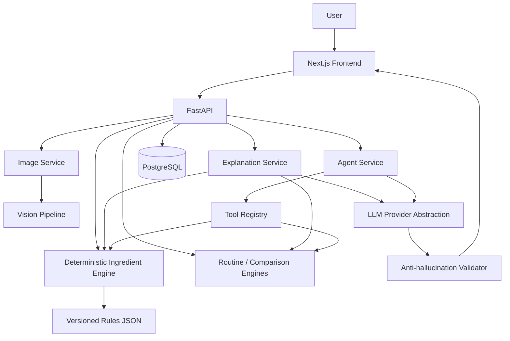

# SkinVision AI

An educational, portfolio-grade skincare analysis platform combining
computer vision, a deterministic ingredient/routine rule engine, and a
bounded, validated LLM explanation layer — built to demonstrate
full-stack AI engineering, not to diagnose anything.

## Why this project exists

This project exists to demonstrate a specific engineering pattern that
matters far beyond skincare: **combining a deterministic system of
record with a generative-AI layer that explains and orchestrates but
never decides.** Concretely, it demonstrates:

- Grounding every LLM response in trusted, already-computed backend
  results — never letting the model be the source of truth for a fact,
  a number, a citation, or a severity.
- A small, custom bounded tool-calling agent (no LangChain/LangGraph/
  agent framework) that selects among deterministic tools and is
  validated after the fact against exactly what those tools returned.
- A deterministic, post-hoc anti-hallucination/safety validator that
  backstops prompt-level instructions rather than trusting them alone.
- A reproducible, offline evaluation harness that measures the system's
  own behavior against version-controlled fixtures — not a one-off
  manual check.
- A complete, working full-stack implementation: FastAPI + async
  SQLAlchemy + PostgreSQL + Next.js, containerized and tested end to end.

It is **not** presented as medically accurate, clinically validated, or
production-ready — see [Limitations](#limitations) and
[Disclaimer](#disclaimer).

## What this demonstrates

| Area | Concretely |
|---|---|
| **AI Engineering** | Provider-abstracted LLM layer (`LLMProvider`) with an Anthropic and an OpenAI-compatible implementation; structured/schema-constrained outputs; a bounded custom tool-calling agent; a deterministic post-hoc anti-hallucination validator (unsupported ingredients, fabricated citations/URLs/numbers, diagnostic claims); Unicode-normalization and prompt-injection resistance; a reproducible offline evaluation harness (104 cases across 7 subsystems) |
| **Backend Engineering** | FastAPI, fully async SQLAlchemy 2.0, PostgreSQL, versioned Alembic migrations, a layered service architecture (API → services → deterministic engines), Pydantic v2 contracts at every boundary, session/chat persistence, a global sanitized-error-response layer |
| **Computer Vision** | OpenCV-based, non-diagnostic visual-observation pipeline (redness, texture, shine, uneven tone, spots/marks) over a face-or-fallback region of interest; a deterministic image-quality gate; reproducible, seed-based synthetic test/eval imagery — no real photos anywhere in the repository |
| **Software Engineering** | 752+ backend tests (real PostgreSQL, no ORM mocking) plus a 104-case evaluation suite, both offline-capable; Docker Compose (3 services, no unnecessary infrastructure); a documented, enforced deterministic/LLM trust boundary; 11 focused documentation files kept in sync with the implementation |

## What this is (and isn't)

SkinVision AI analyzes a skin photo, product ingredient lists, and a
user's skincare routine to produce **non-diagnostic, explainable
skincare insights** — visible characteristics like "visible redness" or
"visible texture," ingredient compatibility notes, and routine ordering
suggestions, each one traceable back to the deterministic rule or tool
call that produced it.

**It is not a medical diagnostic tool.** It never identifies or claims to
detect a medical skin condition (acne, rosacea, eczema, melanoma, etc.), and
every analysis carries this disclaimer:

> SkinVision AI provides educational skincare insights, not medical
> diagnosis or medical advice.

All development and evaluation data is synthetic or generated locally — no
real user photos are stored in this repository.

## Key capabilities

| Capability | What it does |
|---|---|
| **Image quality assessment** | Deterministic gate (resolution, blur, brightness, contrast) runs before any analysis; a rejected image gets a specific, actionable reason, never a silent failure |
| **Visual observations** | Non-diagnostic CV pipeline (OpenCV) reports 5 visible characteristics — redness, texture, shine, uneven tone, spots/marks — each with a score, a heuristic confidence, and its exact computation method |
| **Ingredient analysis** | Deterministic parser/normalizer resolves raw INCI-style text to canonical ingredients, surfacing aliases and ambiguous names honestly rather than guessing |
| **Ingredient compatibility** | A small, source-cited rule set (Cleveland Clinic, AAD) flags documented interactions between specific ingredients — never a fabricated or inferred one |
| **Routine analysis** | Overlapping actives across products, cross-product compatibility, and a suggested AM/PM order with a documented sunscreen-last exception — suggestions stay clearly labeled as suggestions |
| **Product comparison** | Shared vs. unique ingredients, shared active categories, and interactions between two products — deliberately produces no "better product" score |
| **AI explanations** | Plain-language narration of a deterministic result, validated after generation so it can never assert a severity, citation, or number the deterministic result didn't already establish |
| **Agentic chat** | A bounded tool-calling agent picks from 5 deterministic tools, reads their real output, and answers only from what those tools returned — with an inspectable "how it reached this answer" trace |
| **Persistent sessions & history** | Anonymous, no-login sessions; a History page surfaces past analyses, chats, routines, and comparisons, each summarized from already-persisted data, never recomputed |
| **Safety validation** | A deterministic, post-hoc validator rejects unsupported ingredient claims, fabricated citations/URLs/numbers, overclaiming language, and diagnostic-sounding assertions — before any of it reaches a user |
| **Evaluation harness** | 104 reproducible, offline cases across all 7 subsystems, run with `pytest tests/evaluation/` or `python -m evaluation` — a regression gate, not a one-off check |

## Why the architecture separates LLM reasoning from deterministic rules

The LLM is good at understanding natural language, orchestrating tools, and
explaining results in plain language. It is *not* a reliable source of
scientific facts — it can invent a plausible-sounding ingredient interaction
or citation that doesn't exist. So this system draws a hard line:

- **Deterministic Python code** (the ingredient engine, routine analyzer,
  product comparator) makes every rule-based decision — ingredient
  compatibility, conflicts, duplicate actives — driven by versioned,
  source-cited rule files that the LLM cannot edit or override.
- **The LLM** interprets the user's request, decides which deterministic
  tool to call, and turns validated tool output into a personalized
  explanation. It never invents a compatibility verdict, a score, or a
  citation.

See [docs/llm.md](docs/llm.md) for how this is enforced today in the
Phase 6 explanation layer (structurally, via schema, plus a deterministic
anti-hallucination validator), [docs/agent.md](docs/agent.md) for how the
same principle extends to the Phase 7 agent loop, and
[docs/ingredients.md](docs/ingredients.md) for the rule engine.

## Architecture



The trust boundary, conceptually — the LLM sits strictly *after* the
facts are already established, and its output is checked again before
it reaches anyone:

```
User input
    │
    ▼
Deterministic engines (CV / ingredients / routine / comparison)
    │
    ▼
Trusted structured facts (Pydantic models, source-cited rule data)
    │
    ▼
LLM explanation / Agent (orchestrates + narrates only)
    │
    ▼
Post-hoc validation (anti-hallucination, diagnostic-claim, Unicode-normalized)
    │
    ▼
User-facing response
```

Full details: [docs/architecture.md](docs/architecture.md).

## Technology stack

Every item below is actually present in `backend/requirements.txt`,
`backend/requirements-dev.txt`, or `frontend/package.json` — nothing
aspirational.

**Backend**
- Python 3.11, FastAPI, Pydantic v2
- SQLAlchemy 2.0 (fully async) + asyncpg, Alembic migrations
- PostgreSQL 16
- OpenCV (`opencv-python-headless`), Pillow, NumPy — the CV/image pipeline
- pytest, pytest-asyncio, httpx — the test suite

**AI / LLM**
- `LLMProvider` abstraction with an Anthropic implementation and an
  OpenAI-compatible implementation (same interface, swappable)
- Native provider tool-calling (structured function/tool schemas, not
  prompt-parsed text)
- Structured, schema-constrained outputs (`ExplanationLLMOutput`,
  `AgentFinalAnswerLLMOutput`) — no field for a severity, citation, or
  number the LLM could set
- Deterministic post-hoc validation (`app.llm.validation`,
  `app.agent.validation`) — regex/set-membership checks run on every
  LLM/agent output before it can reach a response
- A small, custom bounded tool-calling agent loop — no LangChain,
  LangGraph, or other agent framework
- `FakeLLMProvider` — a deterministic, scriptable fake used by the
  entire test/evaluation suite so neither needs a live API key

**Frontend**
- Next.js 16 (App Router), React 19, TypeScript
- Tailwind CSS

**Infrastructure**
- Docker + Docker Compose (`db`, `api`, `web` — three services, nothing
  else)
- PostgreSQL 16 (containerized)

## Safety boundary

- Never diagnoses a medical condition or claims medical certainty.
- Uses skincare-oriented, non-diagnostic language for every visual
  observation ("visible redness," not "you have rosacea").
- The chat agent's system prompt explicitly forbids diagnosis, prescription,
  and medical-certainty claims, and directs medical questions to a
  qualified healthcare professional instead of answering them; every
  final answer is additionally validated after the fact (see
  [docs/agent.md](docs/agent.md)) rather than trusted on the prompt alone.
- The deterministic ingredient engine never invents an interaction or a
  citation; unsupported claims are not generated. The agent can only
  reference a severity, interaction, or citation that an actual tool call
  returned — never one from its own memory (structurally guaranteed: its
  raw output schema has no field for any of the three).
- No arbitrary code execution: the agent can only invoke a tool already
  registered in `ToolRegistry`, looked up by exact name — never
  `eval`/`exec`/dynamic import/an arbitrary function.
- No real user images are stored in the repository. Uploaded images are
  never logged, and storage is configurable at upload time
  (`IMAGE_RETENTION_MODE=none` analyzes fully in-memory and never writes
  to disk at all; `temporary`, the default, writes the file so the
  vision pipeline can process it). **There is currently no automatic
  deletion/TTL job** — an image written to disk under `temporary` stays
  there until manually removed. See [docs/safety.md](docs/safety.md#upload-safety)
  for the full picture, including the decompression-bomb guard.
- Decompression-bomb protection: an image whose declared decoded
  dimensions are absurdly large is rejected with a controlled 400 before
  any expensive pixel work, not an unhandled server error.
- A global exception handler gives every unexpected error the same
  sanitized `{code, message}` response shape every controlled error
  already uses — never a stack trace, a filesystem path, or an
  environment variable in a response.
- No LLM/database credentials ever reach the frontend: the only
  `NEXT_PUBLIC_*` variable is the API's base URL; `LLM_API_KEY` and
  `DATABASE_URL` are backend-only and never serialized into an API
  response.
- Per-client-IP rate limiting on the two endpoints with a real
  per-request cost (image upload; agent chat) in an app with no
  authentication — a hand-rolled fixed-window limiter, not a dependency
  or Redis; see [docs/safety.md](docs/safety.md#rate-limiting).
- A tool handler's own exception is never returned to the client — it's
  logged server-side and replaced with a fixed, generic message before
  it reaches the (persisted, client-visible) tool trace.

## Evaluation

A reproducible, fully offline evaluation harness — not a one-off manual
check — covering all 7 subsystems. Current results (`python -m evaluation`):

| Subsystem | Cases | Result |
|---|---|---|
| Vision | 15 | 15/15 |
| Ingredients | 28 | 28/28 |
| Routine | 10 | 10/10 |
| Comparison | 8 | 8/8 |
| LLM explanation | 9 | 9/9 |
| Agent | 19 | 19/19 |
| Safety | 15 | 15/15 |
| **Total** | **104** | **104/104** |

**These numbers demonstrate engineering correctness and regression
protection — they are not evidence of clinical or dermatological
accuracy.** The vision cases run against procedurally generated
synthetic images with deliberately controlled properties (a flat color,
a red tint, planted marks); they prove the pipeline behaves correctly
and deterministically on a known input, not that it is accurate against
real skin. See [docs/evaluation.md](docs/evaluation.md) for the full
methodology, every dataset, and an explicit "why this isn't a clinical
benchmark" section.

```bash
cd backend
pytest tests/evaluation/     # regression gate, part of the normal suite
python -m evaluation           # standalone run + JSON report
```

Both are fully offline: every LLM/agent case uses a deterministic
`FakeLLMProvider`, so no `ANTHROPIC_API_KEY`/`OPENAI_API_KEY` or network
access is required or used.

## Testing

752 backend tests pass (real PostgreSQL, no ORM mocking, run inside
Docker) plus the 104 evaluation cases above — both offline-capable, no
LLM API key required.

```bash
docker compose exec api pytest -q        # full backend suite
docker compose exec api pytest tests/evaluation/   # evaluation suite only
docker compose exec api alembic check      # confirm no pending migrations
```

Frontend: `npx tsc --noEmit`, `npm run lint`, and `npm run build` all
pass with zero warnings — see [Development commands](#development-commands)
below.

## Development commands

Everything that must pass before a change is considered done — the
exact commands, not paraphrased:

```bash
# Backend
docker compose exec api pytest -q                    # full backend suite
docker compose exec api pytest tests/evaluation/      # evaluation suite only
docker compose exec api python -m evaluation           # evaluation + JSON report
docker compose exec api alembic check                   # no pending migrations
docker compose exec api alembic upgrade head             # apply migrations

# Frontend (from frontend/)
npx tsc --noEmit      # TypeScript
npm run lint            # ESLint
npm run build             # production build
```

## Project status

- Phase 1 ✅ — repository scaffold, backend skeleton (FastAPI, Pydantic v2
  schemas, SQLAlchemy models, Alembic), frontend skeleton
  (Next.js/TypeScript/Tailwind), Docker Compose, initial docs.
- Phase 2 ✅ — image ingestion (`POST /api/analysis/upload`) and the
  non-diagnostic image quality gate (OpenCV/Pillow: resolution, blur,
  brightness, contrast), with configurable thresholds and retention, real
  database persistence, and a working `/analyze` upload UI.
- Phase 3 ✅ — non-diagnostic visual-observation pipeline
  (`POST /api/analysis/{id}/visual-analysis`): classical OpenCV feature
  extraction (redness, visible texture, shine, uneven tone, visible
  spots/marks) over a face-or-fallback region of interest, with
  configurable thresholds, deterministic/reproducible output, and a
  `/results/[id]` page displaying the results.
- Phase 4 ✅ — deterministic ingredient parser, normalizer, and
  compatibility engine (`POST /api/products/analyze`): 27 canonical
  ingredients, 6 source-cited rules (Cleveland Clinic, American Academy
  of Dermatology), ambiguous-alias handling, reverse-order/duplicate-safe
  compatibility checking, zero network/LLM dependency (verified with
  `docker run --network none`), and an `/compare` page for single-product
  ingredient analysis.
- Phase 5 ✅ — routine intelligence built on the Phase 4 engine, with zero
  duplicated rule logic: `POST /api/routine/analyze` (overlapping actives
  across products, cross-product compatibility, deterministic AM/PM
  ordering with a documented sunscreen-final-AM exception) and
  `POST /api/products/compare` (shared/unique ingredients, shared active
  categories, interactions — no "better product" score). Both endpoints
  are stateless (no migration needed). A `/routine` builder page and a
  two-mode `/compare` page (single-product analysis / two-product
  comparison).
- Phase 6 ✅ — LLM provider abstraction (`LLMProvider`, Anthropic +
  OpenAI-compatible + a deterministic fake for tests/offline dev) and a
  structured AI explanation layer on top of Phases 4/5:
  `POST /api/explanations/{product,compare,routine}`. The LLM explains
  the deterministic result in plain language and can never alter it —
  its output schema has no severity/citation fields, and every response
  passes an anti-hallucination validator before reaching a user. The
  deterministic analysis is always returned, even when the LLM call
  fails. Stateless (no migration). Zero API-key/network dependency in
  tests, verified with `docker run --network none`. `/routine` and
  `/compare` now show an "AI Explanation" section, visually distinct
  from the deterministic results above it, with a clear
  "unavailable" fallback state. See [docs/llm.md](docs/llm.md).
- Phase 7 ✅ — a small, custom agentic tool-calling layer (no LangChain/
  LangGraph/agent framework): `POST /api/agent/chat` lets the LLM choose
  among 5 deterministic tools (each a thin wrapper around an existing
  Phase 4/5 engine call — `check_ingredient_compatibility`,
  `analyze_product`, `compare_products`, `analyze_routine`,
  `get_ingredient_information`), read their structured results, and
  produce a final answer grounded exclusively in what those tools
  returned. The LLM decides *which tool to call*, never *whether an
  ingredient combination is safe* — enforced structurally (its raw
  final-answer schema has no severity/citation field) and by a
  trace-grounded anti-hallucination validator reused from Phase 6. No
  arbitrary code execution: a tool call is an exact-string lookup into a
  pre-registered registry, never `eval`/`exec`/dynamic import. Bounded
  (`AGENT_MAX_TOOL_CALLS=5`, `AGENT_MAX_TURNS=8`), deduplicated, and
  fails safely (an LLM failure, a rejected answer, or a hit limit always
  returns a controlled response with whatever tool trace was collected).
  One migration (`agent_traces` gained `success`/`error_message`
  columns); reuses the Phase 1 `ChatSession`/`ChatMessage`/`AgentTrace`
  models, previously defined but unused. A real `/chat` page replaces
  the placeholder, showing an expandable "How SkinVision AI reached this
  answer" trace. See [docs/agent.md](docs/agent.md).
- Phase 8 ✅ — application integration & persistence: a real application
  session (`POST /api/sessions`, persisted client-side in `localStorage`)
  replaces the previous implicit-and-immediately-orphaned session
  created on almost every request. `GET /api/analysis/{id}` retrieves a
  previously created analysis instead of recomputing it (`/results/[id]`
  now fetches on load and only re-runs the vision pipeline on an
  explicit button press); its status (`quality_rejected` /
  `ready_for_visual_analysis` / `analyzing` / `completed` / `failed`) is
  derived from already-persisted fields, not a guess. `/chat` survives a
  refresh (`GET /api/chat/sessions/{id}/messages` reconstructs the full
  conversation, trace included, from Phase 7's already-persisted rows),
  and a chat can optionally be linked to an existing analysis/product/
  routine/comparison so the agent receives it as trusted context without
  spending a real tool call. Phase 5/6's routine-analysis/comparison
  endpoints stay stateless *by default*, exactly as designed — Phase 8
  adds an opt-in `persist` field rather than reversing that guarantee. A
  real latent bug fixed along the way: `SkinAnalysis.status` could reach
  `analyzing`/`failed` in the Phase 1 schema, but no code ever set
  either — a crash mid-pipeline left a row silently stuck forever; both
  are now wired. One migration (two new tables, four new nullable
  `ChatSession` columns). See [docs/persistence.md](docs/persistence.md).
- Phase 9 ✅ — frontend product polish: zero new backend logic, three
  small additive read-only endpoints (`GET /api/sessions/{id}/products`,
  `.../routine-analyses`, `.../comparisons`, mirroring the Phase 8
  `.../analyses`/`.../chats` pattern exactly — a query + a summary
  schema each, no new columns/migration) so a real **History** page
  (`/history`) could exist at all. Every page now surfaces data an
  endpoint already returned but the UI didn't render yet (visual
  observation `method`, severities, citations, limitations) rather than
  computing anything new. Three duplicated style-map definitions
  (severity badges in `SingleProductAnalyzer`/`ProductComparer`/
  `routine`, agent-status badges in `chat`) collapsed into one
  `StatusBadge`/`SeverityBadge`/`AgentStatusBadge` component set;
  `LimitationList`/`ErrorState`/`EmptyState` replace hand-rolled
  duplicated markup. `/compare` and `/routine` gained an opt-in "save to
  session history" checkbox (using Phase 8's existing `persist` field);
  saved items now show up on `/history` alongside skin analyses and
  chats, each summarized (never recomputed) from already-persisted
  state. `NavBar` gained a working mobile hamburger menu and
  `aria-current` on the active route; a dead placeholder component was
  deleted. Zero backend business logic changed; zero new migrations. See
  [docs/frontend.md](docs/frontend.md).
- Phase 10 ✅ — end-to-end integration + safety hardening, not new
  functionality: a full repository audit against medical/diagnostic
  safety, LLM trust boundaries, prompt injection, tool-call safety,
  numeric/citation safety, disclaimer handling, data/upload safety,
  session safety, and error handling. A deterministic, post-hoc
  diagnostic-claim validator now backstops the system prompt's existing
  "never diagnose" instruction (mirroring how the existing
  `OVERCLAIM_PATTERNS` check already backstops "never guarantee
  safety"), reused by both the Phase 6 explanation layer and the Phase 7
  agent. Unicode normalization (NFKC + zero-width-character stripping)
  hardens every textual safety check against a trivial bypass. A
  decompression-bomb guard closes a real gap in image upload handling
  (a crafted file with an enormous declared decoded size previously hit
  an unhandled 500). A global exception handler gives every unhandled
  error the same sanitized response shape every controlled error
  already used. Everything else audited — the no-auth/access-by-
  possession session model, tool-registry exact-name dispatch,
  citation/numeric grounding, API contract alignment — was confirmed
  already solid by direct code reading and left unchanged; found gaps
  that were explicitly out of scope (no auth, no idempotency
  infrastructure, no image-deletion job) are documented, not built.
  Zero migrations. See [docs/safety.md](docs/safety.md).
- Phase 11 ✅ — a reproducible evaluation harness (`backend/evaluation/`,
  a package separate from and never imported by the application, plus
  `backend/tests/evaluation/` pytest integration): 104 cases across 7
  subsystems (vision, ingredients, routine, comparison, LLM explanation,
  agent, safety), every case calling real production code against its
  actual output rather than a second, parallel implementation of any
  check. Fully offline by default — every LLM/agent case uses
  `FakeLLMProvider`, zero network access or API key required, verified
  with `docker run --network none`. No combined "AI accuracy" number
  anywhere — every metric is reported per subsystem. Run it with
  `pytest tests/evaluation/` (regression gate, no report file) or
  `python -m evaluation` (writes a JSON report to
  `evaluation/reports/`). **Not a clinical accuracy benchmark** — the
  vision fixtures are procedurally generated synthetic images proving
  deterministic pipeline behavior on controlled inputs, never real-world
  or medical accuracy; this is stated explicitly, repeatedly, and
  prominently in [docs/evaluation.md](docs/evaluation.md) rather than
  left implicit. Zero migrations, zero frontend changes.
- Phase 12 ✅ — final testing, documentation, Docker reproducibility,
  security, and portfolio polish. Not new functionality: a repository
  audit (stale language, dead code, broken doc links, endpoint drift,
  overclaiming, terminology) found the codebase already in strong shape
  and fixed the two real issues it turned up (an unused import; a
  README tagline claiming "multimodal LLM reasoning" that contradicted
  the LLM's actual text-only input). This README was substantially
  expanded — not rewritten — into the structure you're reading now.
  Verified via a genuinely clean rebuild (`docker compose down -v` +
  `build --no-cache` + `up`, from an empty database) that the full
  backend suite (752 tests) and evaluation harness (104/104) both still
  pass, and via a full browser smoke test across every major flow
  (image analysis with refresh-without-recompute, ingredient analysis +
  AI explanation, product comparison with history persistence, routine
  analysis, agent chat with a real tool trace, chat resumed from
  History, and controlled handling of an LLM-unavailable provider,
  malformed input, an unknown ingredient, and a corrupted image
  upload). This is the final planned phase — see
  [Future work](#future-work) for what's deliberately not built.

## Setup

### Prerequisites

- Docker + Docker Compose
- Node.js 20+ (for local frontend dev outside Docker)
- Python 3.11+ (for local backend dev outside Docker; native deps arriving
  in later phases are verified in Docker, not local venvs)

### Run everything with Docker Compose

```bash
cp backend/.env.example backend/.env
docker compose up --build
```

- API: http://localhost:8010 (health check at `/health`)
- Web: http://localhost:3010

### Backend, locally

```bash
cd backend
python -m venv .venv && source .venv/bin/activate
pip install -r requirements-dev.txt
cp .env.example .env
pytest
uvicorn app.main:app --reload
```

`pytest` requires a reachable PostgreSQL matching `DATABASE_URL` (e.g. `docker
compose up -d db`, then `alembic upgrade head`) — API and service-layer tests
exercise the real database rather than mocking the ORM. OpenCV
(`opencv-python-headless`) may need `libglib2.0-0`/`libgomp1` installed
locally on Linux; this is handled automatically in the Docker image.

### Evaluation harness

```bash
cd backend
pytest tests/evaluation/       # regression gate, part of the normal test suite
python -m evaluation             # standalone run, writes a JSON report to evaluation/reports/
```

Fully offline by default — no `ANTHROPIC_API_KEY`/`OPENAI_API_KEY` or
network access needed for either command; every LLM/agent case uses a
deterministic `FakeLLMProvider`. See [docs/evaluation.md](docs/evaluation.md).

### Frontend, locally

```bash
cd frontend
npm install
cp .env.local.example .env.local
npm run dev -- --port 3010
```

## Repository layout

```
skinvision-ai/
├── backend/
│   ├── app/                 FastAPI app: api/, services/, agent/, llm/, vision/, ingredients/,
│   │                          routine/, products/, models/, schemas/, core/
│   ├── alembic/              versioned database migrations
│   ├── evaluation/            offline evaluation harness (Phase 11) — datasets/, runners/, metrics.py
│   ├── rules/                 versioned, source-cited ingredient/routine rule JSON
│   ├── tests/                 backend test suite (752 tests) + tests/evaluation/
│   └── datasets/              gitignored local fixture scaffold (no binary photos ever committed)
├── frontend/
│   └── src/
│       ├── app/                Next.js App Router pages (/, /analyze, /results/[id], /compare,
│       │                        /routine, /chat, /history)
│       ├── components/          shared UI (StatusBadge, ErrorState, EmptyState, Disclaimer, ...)
│       └── lib/                 typed API client, session persistence
├── docs/                   architecture, vision, ingredients, routine, llm, agent, safety, evaluation, ...
└── docker-compose.yml       db (Postgres 16) + api (FastAPI) + web (Next.js)
```

## Documentation

- [docs/architecture.md](docs/architecture.md) — system design and phase plan
- [docs/vision.md](docs/vision.md) — computer vision pipeline
- [docs/ingredients.md](docs/ingredients.md) — deterministic ingredient engine
- [docs/routine.md](docs/routine.md) — routine analysis and product comparison
- [docs/llm.md](docs/llm.md) — LLM provider abstraction and explanation layer
- [docs/agent.md](docs/agent.md) — agent/tool-calling architecture
- [docs/persistence.md](docs/persistence.md) — application sessions, database relationships, analysis/chat lifecycle
- [docs/api.md](docs/api.md) — API reference
- [docs/frontend.md](docs/frontend.md) — frontend structure, screens, shared components
- [docs/safety.md](docs/safety.md) — consolidated safety architecture: diagnostic-claim validation, LLM trust boundaries, prompt injection, tool-call safety, upload safety, error handling, known limitations
- [docs/evaluation.md](docs/evaluation.md) — evaluation harness: datasets, runners, metrics, report format, offline execution, and why it isn't a clinical benchmark

## Limitations

This is a portfolio project, not a clinical tool. Stated plainly, not
buried:

- **No clinical or dermatological validation of any kind.** Visual
  observations come from classical OpenCV heuristics (Laplacian
  variance, HSV/Lab channel statistics, blob detection), calibrated
  against synthetic test images, never against real skin or a real
  medical outcome.
- **The evaluation harness proves engineering correctness and
  regression protection, not real-world accuracy** — see
  [Evaluation](#evaluation) and [docs/evaluation.md](docs/evaluation.md).
- **Visual observations are heuristic estimates**, affected by lighting,
  camera quality, makeup, filters, shadows, and image resolution; they
  are not tone-corrected, and "apparent dryness" is explicitly never
  estimated at all (see [docs/vision.md](docs/vision.md)).
- **The ingredient rule set is intentionally small and curated** — 27
  canonical ingredients, 6 source-cited compatibility rules — not an
  exhaustive dermatological database. An ingredient or interaction not
  in the rule set is reported as unrecognized, never guessed.
- **Safety/anti-hallucination validators are heuristic** (regex and
  set-membership over LLM text), deliberately biased toward
  over-rejection rather than under-rejection — see
  [docs/safety.md](docs/safety.md).
- **No authentication or accounts.** Sessions are anonymous UUIDs;
  possessing a session/analysis/chat id grants access to it, exactly
  like every other UUID-addressable resource in this app. This is a
  disclosed, deliberate scope boundary, not an oversight.
- **No automatic image deletion/TTL job.** An uploaded image written to
  disk (the default `temporary` retention mode) stays there until
  manually removed; `IMAGE_RETENTION_MODE=none` avoids writing it at
  all if that matters for a given run.
- **No real-world dermatological accuracy claim of any kind** — this
  project describes visible characteristics and documented ingredient
  interactions; it does not diagnose, does not guarantee an outcome,
  and does not replace professional care.

## Future work

Deliberately not built, to keep this project's scope honest and
finished rather than perpetually expanding. Listed here as documented
possibilities, not commitments:

- Authentication and per-user accounts (the current anonymous,
  access-by-possession session model would need to change alongside it,
  not just have a login screen bolted on).
- A genuinely sourced, appropriately licensed clinical/dermatological
  dataset and methodology — the only way this project's evaluation
  claims could ever legitimately expand beyond "engineering
  correctness."
- Broader ingredient rule coverage (more canonical ingredients, more
  compatibility rules) — always additive to the existing versioned rule
  files, never a rewrite of how they're validated or applied.
- Improved/learned CV models as an optional supplement to the existing
  classical heuristics (CLIP/ViT were considered from Phase 1 onward and
  deliberately deferred — see [docs/vision.md](docs/vision.md)) —
  never replacing the deterministic, reproducible baseline.
- An automated image-retention/cleanup job (currently a disclosed,
  honest gap, not a silent one).
- Cloud deployment, observability/monitoring, and CI wiring for the
  existing offline-capable test/evaluation suites.

None of the above is implemented in this repository. Nothing above is
promised for a specific timeline.

## Disclaimer

SkinVision AI is an educational and portfolio engineering project. It is
**not** a medical device, does not provide medical or dermatological
diagnosis, and is not a substitute for professional care. It uses
synthetic and demo data throughout development and evaluation. If you
have a medical or dermatological concern, consult a qualified healthcare
professional.
