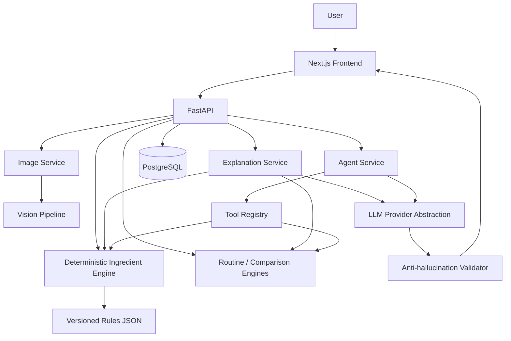

# Architecture

## System overview



Note: `ToolRegistry` does not include the Vision Pipeline as of Phase 7 —
the agent's 5 tools cover ingredients/routine/comparison only; see
[agent.md](agent.md#deviations-from-the-original-sketch).

**Core principle:** the LLM orchestrates and explains; deterministic Python
code decides. Every rule-based output (ingredient compatibility, routine
conflicts, product comparison) is computed by typed, tested Python — never
inferred by the LLM. See [agent.md](agent.md) for how the agent loop
enforces this.

### The trust boundary

Every request-response cycle that touches the LLM passes through the
same shape, regardless of which endpoint it is:

```
User input
    │
    ▼
Validation (Pydantic schemas at every API boundary, extra="forbid")
    │
    ▼
Deterministic engines (CV / ingredients / routine / comparison)
    │
    ▼
Trusted structured facts (typed models; the LLM's own output schemas
have no field for a severity, citation, or number to occupy)
    │
    ▼
LLM / Agent (orchestration + natural-language narration only)
    │
    ▼
Post-hoc validation (app.llm.validation / app.agent.validation --
unsupported ingredients, fabricated citations/URLs/numbers, overclaiming
language, diagnostic-sounding claims; Unicode-normalized first)
    │
    ▼
User-facing response
```

A rejection at the post-hoc validation step never surfaces the rejected
text — it degrades to a controlled, generic response
(`explanation_status="unavailable"` or `AgentStatus.VALIDATION_ERROR`)
with the deterministic result/tool trace, which was never at risk,
still returned intact. See [llm.md](llm.md#anti-hallucination-validation),
[agent.md](agent.md#anti-hallucination-validation), and
[safety.md](safety.md) for the full detail behind each stage.

## Modular monolith, not microservices

This is intentionally a single FastAPI application with clearly separated
internal modules, not a microservice mesh — appropriate for a portfolio
project's scope. See section "Do not overengineer" in the project brief:
no Kubernetes, no event bus, no heavy agent framework, no unnecessary auth.

## Backend module layout

```
backend/app/
├── main.py            FastAPI app + middleware + router registration
├── config.py           Settings (pydantic-settings, env-driven)
├── database.py         Async SQLAlchemy engine/session, declarative Base
├── models/              SQLAlchemy ORM models (11 tables, see below)
├── schemas/             Pydantic v2 DTOs — the typed contracts every
│                        component (vision, ingredients, agent) is built
│                        against
├── api/                 FastAPI routers: `health` (Ph. 1), `analysis`
│                        (Ph. 2 upload, Ph. 3 visual-analysis, Ph. 8 GET
│                        retrieval), `products` (Ph. 4 analyze, Ph. 5
│                        compare + Ph. 8 opt-in persist), `routine`
│                        (Ph. 5 analyze + Ph. 8 opt-in persist),
│                        `explanations` (Ph. 6 product/compare/routine --
│                        each re-runs its Phase 4/5 deterministic
│                        computation itself), `agent` (Ph. 7
│                        `/api/agent/chat`, Ph. 8 adds `link`),
│                        `sessions`, `chat` (Ph. 8: session and
│                        chat-history retrieval)
├── services/             Orchestration tying validation + engines + DB
│                        together per feature; keeps routers thin
│                        (image_service Ph. 2, vision_service Ph. 3,
│                        ingredient_service Ph. 4, shared session_service
│                        (Ph. 8 adds read queries), explanation_service
│                        Ph. 6, agent_service Ph. 7 (Ph. 8 adds linked-
│                        context injection), persistence_service,
│                        analysis_query_service, chat_query_service
│                        (Ph. 8, read-only/opt-in-write) -- Phase 5's two
│                        endpoints stay stateless by default and call
│                        their engines directly)
├── vision/              quality.py (Ph. 2): image quality gate.
│                        preprocessing.py, region.py, redness.py,
│                        texture.py, shine.py, tone.py, spots.py,
│                        analyzer.py (Ph. 3): visual-observation pipeline
├── ingredients/         parser.py, normalizer.py, compatibility.py,
│                        rules.py, models.py (Ph. 4): deterministic
│                        ingredient engine -- no LLM, no network, ever
├── routine/              analyzer.py, overlap.py, ordering.py, rules.py,
│                        models.py (Ph. 5): routine analysis, built on
│                        the Phase 4 engine, stateless
├── products/             comparator.py (Ph. 5): product-vs-product
│                        comparison, also built on the Phase 4 engine
├── llm/                  LLMProvider abstraction, prompts, structured
│                        output schema, DeterministicContext builders,
│                        anti-hallucination validator (Ph. 6) -- explanation
│                        layer only, no domain-decision authority; extended
│                        in Ph. 7 with generate_with_tools + the
│                        ConversationTurn/ToolSpec/AgentLLMResponse shapes
│                        native tool-calling needs; see docs/llm.md
├── agent/                schemas.py, registry.py, tools.py, prompts.py,
│                        trace.py, validation.py, agent.py (Ph. 7): the
│                        bounded tool-calling loop, its 5 tools (each a
│                        thin wrapper around an existing Phase 4/5 engine
│                        call, no new skincare logic), and its
│                        anti-hallucination validation, reusing Phase 6's
│                        checks against the accumulated tool trace; see
│                        docs/agent.md
└── core/                 Upload validation (Ph. 2), rule_loading.py
                         (shared by ingredients/ and routine/, Ph. 5),
                         logging, shared dependencies
```

## Data model

| Model | Purpose |
|---|---|
| `UserSession` | Anonymous session identity (no auth) |
| `ImageMetadata` | Uploaded image metadata; never stores raw bytes in DB |
| `SkinAnalysis` | One analysis run: image + visual observations + structured response |
| `QuestionnaireResponse` | Self-reported goals/routine/preferences for an analysis |
| `Ingredient` | Reserved (unused as of Phase 4) canonical ingredient reference table -- the ingredient engine's source of truth is the versioned JSON rule files, not this table; see docs/ingredients.md |
| `Product` | User-entered product + parsed ingredient list + full compatibility analysis result (`analysis_result`, Phase 4) |
| `Routine` / `RoutineItem` | User-curated, persisted AM/PM product sequences -- defined Phase 1, still unused (no CRUD endpoint yet); distinct from `RoutineAnalysisRecord` below |
| `ChatSession` / `ChatMessage` | Copilot chat -- defined Phase 1, actually used starting Phase 7. Phase 8 adds four nullable linkage columns to `ChatSession` (`skin_analysis_id`/`product_id`/`routine_analysis_id`/`comparison_id`, each `ON DELETE SET NULL`) so a chat can optionally reference one existing analysis/product/routine/comparison result |
| `AgentTrace` | Persisted tool-call trace behind an assistant message -- defined Phase 1, used starting Phase 7; gained `success`/`error_message` columns in Phase 7 (the original schema had no way to record a failed tool call) |
| `RoutineAnalysisRecord` / `ComparisonRecord` | Phase 8: opt-in persisted copies of a `RoutineAnalysisRequest`+`Result` / `ProductCompareRequest`+`Result` (mirrors `Product.analysis_result`'s JSON pattern) -- written only when the request sets `persist: true`; Phase 5's endpoints stay stateless by default |

Full field definitions: `backend/app/models/`. Migrations are managed with
Alembic (`backend/alembic/`). Phase 3 added no new tables or columns — it
reuses `SkinAnalysis.visual_observations` and `.structured_response`
(JSON columns already defined in Phase 1), only relaxing
`ImageMetadata.storage_path` to nullable in Phase 2. Phase 4 added one
column: `Product.analysis_result` (JSON), storing the full deterministic
`CompatibilityResult` for that product. **Phase 5 added no migration at
all** — both new endpoints (`/api/routine/analyze`,
`/api/products/compare`) are stateless pure functions of their request
body; see [docs/routine.md](routine.md#statelessness-why-phase-5-needed-no-database-migration).
**Phase 6 also added no migration** — its three explanation endpoints are
equally stateless. Phase 7 added exactly one migration: two columns on
`AgentTrace` (`success`, `error_message`) so a failed tool call can be
recorded rather than only ever a successful one; every other Phase 7
table (`ChatSession`, `ChatMessage`, the rest of `AgentTrace`) already
existed, unused, since Phase 1. **Phase 8 added exactly one migration**:
two new tables (`RoutineAnalysisRecord`, `ComparisonRecord`) and four
new nullable columns on `ChatSession` -- see
[docs/persistence.md](persistence.md) for the full schema and why each
decision was made.

## API design

Dedicated Pydantic request/response schemas at every endpoint — SQLAlchemy
models are never exposed directly. See [api.md](api.md).

## Frontend

Next.js App Router, TypeScript, Tailwind. The frontend contains **zero**
skincare logic — no ingredient compatibility, scoring, or recommendation
computation in TypeScript. It only collects input and renders
backend-validated results. See [docs/frontend.md](frontend.md) for the
full screen inventory, shared component set, and the Phase 9
history/session UX built on top of Phase 8's persistence.

## Evaluation harness

A separate `backend/evaluation/` package (never imported by `app/`) that
runs the real production engines/services against version-controlled
fixtures and reports pass/fail per subsystem — a regression gate, not
part of the request-response path. See [evaluation.md](evaluation.md)
and [Notes from Phase 11](#notes-from-phase-11) below.

## Docker deployment

Three services, `docker-compose.yml`: `db` (PostgreSQL 16), `api`
(FastAPI, runs `alembic upgrade head` on startup then `uvicorn`), `web`
(Next.js, standalone production build). No other infrastructure —
no Redis, no Celery, no message broker, no Kubernetes. `api` reads
config from `backend/.env`; `web` reads `NEXT_PUBLIC_API_BASE_URL` from
`frontend/.env.local` (the only value it needs — no secret ever reaches
the frontend build). See the root `README.md`'s Setup section for the
exact commands.

## Phase plan and status

| Phase | Scope | Status |
|---|---|---|
| 1 | Project scaffold: backend/frontend skeletons, Docker Compose, schemas, docs | **Done** |
| 2 | Image ingestion + quality pipeline | **Done** |
| 3 | CV visual-observation pipeline | **Done** |
| 4 | Ingredient parser + deterministic compatibility engine | **Done** |
| 5 | Routine analysis + product comparison | **Done** |
| 6 | LLM provider abstraction + structured explanation layer | **Done** |
| 7 | Agent tool-calling orchestration | **Done** |
| 8 | Application integration & persistence hardening | **Done** |
| 9 | Next.js frontend product polish (full screens, History) | **Done** |
| 10 | End-to-end integration + safety layer | **Done** |
| 11 | Evaluation harness | **Done** |
| 12 | Testing, docs, Docker, portfolio polish | **Done** |

## Notes from Phase 6

- The LLM is strictly an explanation layer, never a source of truth --
  enforced structurally, not just by prompting: `ExplanationLLMOutput`
  (the LLM's raw output schema) has no `severity`, `source`, or
  `source_url` field at all, so there is no field for the model to write
  an altered severity or a fabricated citation into. The final
  `Explanation` returned to the client is assembled by the backend from
  the deterministic result plus only the LLM's narrative text. See
  [docs/llm.md](llm.md).
- All three explanation endpoints (`/api/explanations/{product,compare,routine}`)
  are stateless, like Phase 5's endpoints -- `alembic check` reported no
  new migration needed after this phase's entire implementation.
- Every LLM response passes a deterministic anti-hallucination validator
  (`app.llm.validation`) before it can reach a user, checked against a
  `DeterministicContext` built from the *same* result object already
  returned to the frontend (no second, possibly-drifted copy). A
  rejected or failed explanation never withholds the deterministic
  analysis -- the response is always `200` with `analysis` present;
  `explanation_status: "unavailable"` communicates the LLM-layer failure
  separately.
- Entire test suite (`tests/llm/`, `tests/test_explanation_api.py`) runs
  against a deterministic `FakeLLMProvider` or a mocked/`httpx.MockTransport`-
  intercepted real provider -- zero API key or network dependency,
  verified with `docker run --network none`.
- `get_llm_provider()` never raises at construction time -- a missing key
  or unsupported provider name is deferred to a `FakeLLMProvider(raise_error=...)`
  that fails at the same call site a genuine runtime failure would,
  keeping "misconfigured" and "failed at runtime" one code path for every
  caller instead of two.

## Notes from Phase 7

- The agent is strictly an orchestration layer, never a source of truth,
  extending the exact same structural guarantee Phase 6 established: the
  raw LLM-facing final-answer schema has no severity/citation/interaction
  field, so there is no field for the model to write a domain fact into.
  Every value a user sees precisely (a severity, a rule_id, a citation)
  comes from `AgentResponse.tool_trace`, assembled by the backend from
  real tool results. See [docs/agent.md](agent.md).
- All five agent tools are thin wrappers around existing Phase 4/5
  deterministic engine calls — zero new skincare logic was written this
  phase. The agent layer only adds orchestration (tool selection, the
  bounded loop, trace-grounded validation) on top of engines that were
  already fully tested in Phases 4-5.
- No arbitrary code execution anywhere in the tool-call path: a tool
  "call" is an exact-string dict lookup into a pre-registered
  `ToolRegistry`, never `eval`/`exec`/`importlib`/`getattr`-on-an-
  arbitrary-name. An unregistered tool name (`"execute_python"`,
  `"import"`) is rejected before any code runs.
- Reused, rather than duplicated, Phase 6's anti-hallucination machinery:
  the regex/set-membership checks in `app.llm.validation` were made
  public specifically so `app.agent.validation` could import them
  directly, applied against a ground-truth set built from the
  *accumulated tool trace* instead of a single deterministic result.
- One migration this phase (`agent_traces.success`/`.error_message`) —
  every other table the agent uses (`ChatSession`, `ChatMessage`, the
  rest of `AgentTrace`) was already defined in Phase 1 and simply never
  used until now; `alembic check` confirms no other migration was
  needed.
- `LLMProvider.generate_with_tools` was added *additively* to the Phase 6
  interface (`generate_structured` is unchanged and still used by the
  explanation layer) — both methods coexist on every real provider.

## Notes from Phase 8

- Turned five independently-working capabilities into one coherent
  application: an application session (previously created implicitly and
  immediately orphaned on almost every request) is now created once,
  persisted client-side (`localStorage`), and reused everywhere.
- Preserved every prior phase's documented design intentionally rather
  than reversing it for convenience: Phase 5/6's stateless routine-
  analysis/comparison/explanation endpoints stay stateless *by default*
  — Phase 8 adds an opt-in `persist` flag rather than making them always
  write to the database, specifically so their original "a client can
  never submit a forged already-computed result" guarantee stays true
  for every existing caller.
- `/results/[id]` changed from unconditionally re-running the Phase 3
  vision pipeline on every visit to retrieving the already-persisted
  result via a new `GET /api/analysis/{id}` — the pipeline is still
  exactly as idempotent as before, but is now triggered explicitly
  rather than implicitly on every page load.
- A real, previously-latent bug fixed as part of this phase's lifecycle
  work: `SkinAnalysis.status` could reach `analyzing`/`failed` in the
  Phase 1 schema but no code ever set either value — an unhandled
  exception mid-pipeline left a row silently stuck at `image_uploaded`
  forever. Both are now wired in `vision_service.analyze_visual_features`.
- The agent's linked-context feature (`ChatSession` → an existing
  analysis/product/routine/comparison) reuses Phase 7's `run_agent`
  machinery unmodified in spirit: a linked result is injected as a
  `seed_trace` entry and treated exactly like a real executed tool call
  — included in `app.agent.validation`'s ground truth from the first
  turn — rather than as a special-cased trusted-by-fiat input. No new
  validation code path was needed.
- One migration this phase, confirmed with `alembic check` both
  immediately after writing it and again at the end of the full
  implementation.

## Notes from Phase 10

Integration/safety hardening, not new functionality — a full audit
across the categories in [docs/safety.md](safety.md), with fixes only
where a real, verified gap was found:

- A deterministic, post-hoc diagnostic-claim validator
  (`DIAGNOSTIC_CLAIM_PATTERN`) backstops the system prompt's existing
  "never diagnose" instruction, mirroring how `OVERCLAIM_PATTERNS`
  already backstops "never guarantee safety" — the one place in the
  safety model that was previously enforced by instruction alone.
- Unicode normalization (NFKC + zero-width-character stripping) added
  ahead of every textual validation check, closing a narrow, scoped
  bypass class without attempting general homoglyph detection.
- A decompression-bomb guard closes a real gap: a small, crafted image
  file whose declared header dimensions imply an enormous decoded pixel
  count previously fell through to an unhandled 500 (Pillow's
  `DecompressionBombError`/`Warning` are not `OSError`/`ValueError`).
- A global exception handler (`app/main.py`) gives every unhandled
  exception the same sanitized `{code, message}` shape every other
  error response already used, instead of Starlette's default — without
  intercepting any existing controlled 4xx.
- Audited and confirmed, not changed: the anonymous access-by-possession
  session model (no auth, unchanged, explicitly out of scope to "fix"),
  tool-registry exact-name dispatch, citation/numeric-claim grounding,
  and API contract alignment between frontend and backend — all already
  solid, verified by direct code reading rather than assumed from prior
  phase reports.
- Zero migrations. Every fix is backend logic, tests, or documentation.

## Notes from Phase 11

A new, self-contained `backend/evaluation/` package (never imported by
`app/`) plus `backend/tests/evaluation/` pytest integration — a
reproducible evaluation harness, not a one-off script or a collection of
manually inspected examples:

- 7 subsystems (vision, ingredients, routine, comparison, llm, agent,
  safety), 104 evaluation cases total, every one calling real production
  code (`run_visual_analysis`, `check_pair`, `analyze_routine`,
  `compare_products`, `explain_product`, `run_agent`) against its actual
  output — never a second, parallel implementation of any check.
- Fully offline by default: every LLM/agent case uses `FakeLLMProvider`;
  zero network access or API key required for the default suite,
  verified with `docker run --network none`.
- No combined "AI accuracy" number anywhere — every metric
  (`evaluation/metrics.py`) is reported per subsystem, matching this
  project's existing "each subsystem's numbers stay separate" discipline
  from every prior phase's completion report.
- Reuses the existing Phase 2/3 synthetic-image generators
  (`tests.helpers.images`) for vision fixtures rather than a second
  image-generation implementation — a deliberate DRY choice, since the
  same procedurally-generated-at-runtime pattern (no binary image ever
  committed) already existed and `backend/datasets/images/` is already
  gitignored for exactly that reason.
- Explicitly and repeatedly documents (in `docs/evaluation.md`'s own
  dedicated section) that none of this proves clinical or dermatological
  accuracy — an engineering/regression/safety tool, not a medical
  validation one.
- Zero migrations, zero frontend changes, zero application-code changes.

## Notes from Phase 12 (final phase)

Final testing, documentation, Docker reproducibility, security, and
portfolio-presentation polish — audited against the actual repository
rather than assumed, with fixes applied only where the audit found a
real, verified issue:

- A full repository audit (stale language, dead code, broken doc links,
  endpoint/route drift, overclaiming, terminology consistency) found the
  codebase already in strong shape — most categories had zero findings.
  Two real fixes applied: an unused `AgentStatus` import in
  `app/services/agent_service.py`, and a stale README tagline claiming
  "multimodal LLM reasoning" (the LLM is text-only — it never receives
  image data, confirmed by reading `app/llm/context.py`; corrected to
  avoid contradicting the project's own documentation).
- `README.md` substantially expanded (not rewritten from scratch —
  the existing per-phase build log was accurate and kept) with a
  portfolio-facing structure: what this demonstrates (categorized by
  AI/Backend/CV/Software engineering), key capabilities, a dedicated
  Evaluation section with the actual current per-subsystem numbers, an
  itemized Limitations section, and a Future Work section.
- Verified via a genuinely clean rebuild: `docker compose down -v`
  (including the Postgres volume) → `docker compose build --no-cache`
  (both `api` and `web`) → `docker compose up` — migrations applied
  automatically from an empty database, health check passed, a real
  database write succeeded, and the complete backend test suite (752)
  and evaluation harness (104/104) both passed against the freshly
  built image.
- A full end-to-end browser smoke test across all major flows (image
  upload → visual analysis → results → refresh-without-recompute;
  single-product analysis + AI explanation; product comparison +
  persistence; routine analysis including the "unknown category stays
  unscheduled, never fabricated" path; agent chat with a real tool
  trace; chat resumed from History with the full conversation
  restored; and controlled failure handling for an LLM-unavailable
  provider, malformed JSON, an unknown ingredient, and a corrupted
  image upload) — all passed, zero console errors from the application
  itself.
- 320MB of accumulated local test-upload images (gitignored runtime
  data from repeated local testing across every prior phase, not
  source-controlled) cleared for repository hygiene.
- No new dependencies, no new migrations, no architectural changes.

## Risks and assumptions carried from Phase 1

- No `ANTHROPIC_API_KEY` (or other provider key) is available in this
  environment yet; Phase 6/7 will need one for live LLM testing. Tests are
  designed to mock the `LLMProvider` so CI never depends on a live key.
- CLIP/ViT is an **optional future supplement**, never a required
  dependency and never presented as a diagnostic classifier — see
  [vision.md](vision.md).
- Local development machine has Python 3.14 and no local Postgres; all
  native-dependency and database work is verified against Docker
  (Python 3.11 + Postgres 16), not a local venv.

## Notes from Phase 3

- Empirical testing against synthetic images caught and fixed two real
  methodology bugs before they shipped: uneven-tone conflating with pure
  texture noise, and the spots/marks detector spuriously counting ~4,500
  noise pixels as "marks" on a blank frame. Both are described with the
  fix in [vision.md](vision.md) as a demonstration of verifying claims
  against actual runs rather than assuming correctness.
- Redness measurement is knowingly not skin-tone-corrected; this is
  disclosed as a fairness limitation, not silently shipped.
- Region-of-interest selection uses OpenCV's bundled Haar-cascade face
  detector for localization only — no facial identity/embedding data is
  computed or stored.

## Notes from Phase 4

- Every compatibility rule was sourced by actually fetching the cited
  page (Cleveland Clinic, American Academy of Dermatology) at authoring
  time, not recalled from general knowledge — see docs/ingredients.md's
  source policy, including the two candidate rules that were
  investigated and deliberately *not* added for lack of a directly
  on-topic authoritative source.
- Real bug caught by testing against the shipped rule set itself (not
  just synthetic fixtures): multi-word canonical ingredient names
  (`glycolic_acid`) never matched their natural-spacing form ("Glycolic
  Acid") as typed in any real ingredient list — only single-word names
  worked. Fixed in `rules.py`; see docs/ingredients.md.
- The ingredient engine has zero network dependency, verified by running
  its full test suite inside a Docker container with `--network none`.
- `Ingredient` (the SQL table from Phase 1) remains intentionally unused
  — the rule files are the engine's single source of truth, not the
  database, keeping the engine's core logic independent of DB
  availability.

## Notes from Phase 5

- Routine analysis and product comparison reuse Phase 4's compatibility
  engine by calling it once over the *combined* ingredient list of every
  product involved, rather than writing any routine-specific rule
  matching — see docs/routine.md for exactly how this avoids
  duplicating Phase 4 while still correctly deduplicating a finding that
  the same active triggers across multiple products.
- Both new endpoints are deliberately stateless: `alembic check` reports
  no new migration was needed after this phase's entire implementation.
- Two rule files (`ordering.json`, `overlap.json`), not the three the
  master architecture offered as an option — the sourced assertions
  folded naturally into the two files that already needed a source for
  their own methodology; a third file would have had nothing left to
  hold. See docs/routine.md.
- Sourced from two real, fetched AAD pages (product-application order;
  general "too many actives" caution) — the same fetch-and-verify
  discipline as Phase 4, not recalled from general knowledge.
