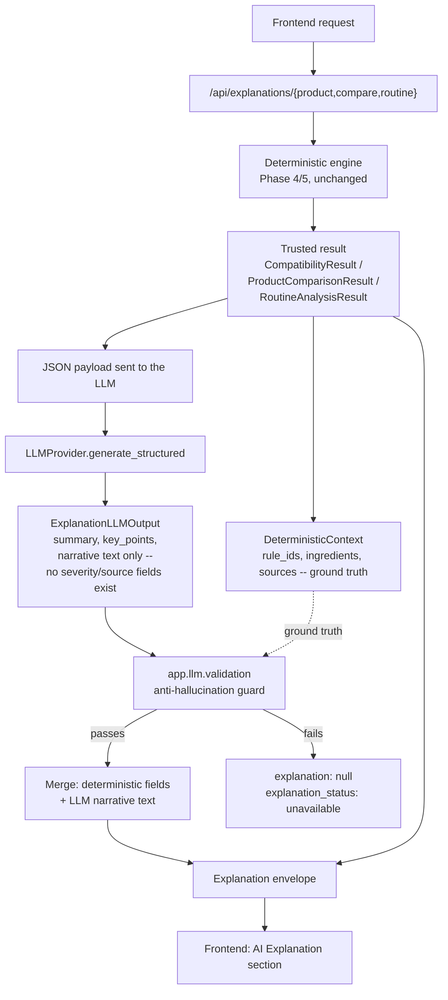

# LLM Explanation Layer (Phase 6)

## The one rule this document exists to explain

**The LLM is an explanation layer. It is never a source of truth.**

Every fact in an AI explanation — which ingredients interact, how severe
that interaction is, what the citation says — is computed by the
deterministic engines from Phases 4/5 (`app.ingredients`, `app.routine`,
`app.products`) before the LLM is ever called. The LLM's only job is to
turn an already-correct, already-cited, already-validated result into
plain-language narrative text. It cannot invent an ingredient, alter a
severity, fabricate a citation, or claim something is "safe" that the
deterministic engine only said has "no known conflict."

This is enforced structurally (the LLM's output schema has no field to
put a severity or citation in), not just by prompting it not to.



The deterministic `Result` always reaches the frontend, in the same
response, regardless of whether the LLM call above it succeeds.

## Provider abstraction

`backend/app/llm/base.py` defines the only interface the rest of the
application depends on:

```python
class LLMProvider(ABC):
    async def generate_structured(
        self, system_prompt: str, input_data: dict, response_model: type[ResponseModel]
    ) -> ResponseModel: ...
```

Phase 7 added a second, additive method to this same interface —
`generate_with_tools(system_prompt, history, tools, response_model)` —
for the agent's tool-calling loop. `generate_structured` above is
unchanged and still exactly what the explanation layer in this document
uses; the two coexist on every real provider. See
[docs/agent.md](agent.md#provider-tool-calling-contract) for the
tool-calling contract itself.

Three implementations (`backend/app/llm/provider.py`):

| Provider | Used when | Notes |
|---|---|---|
| `AnthropicProvider` | `LLM_PROVIDER=anthropic` (default) | Forced tool-use (`tool_choice={"type":"tool",...}`) against the Anthropic Messages API turns `response_model.model_json_schema()` directly into the tool's input schema, so the SDK/model can only return JSON already shaped like the Pydantic model. |
| `OpenAICompatibleProvider` | `LLM_PROVIDER=openai` | Same idea via OpenAI-style function calling (`tool_choice={"type":"function",...}`) against any `/chat/completions`-compatible endpoint (`LLM_BASE_URL`), over plain `httpx` — no vendor SDK dependency. Demonstrates the abstraction isn't Anthropic-specific. |
| `FakeLLMProvider` | `LLM_PROVIDER=fake`, and unconditionally in every test | No network, no API key. Returns a deterministic, honest summary derived directly from the input data (or a fixed/error response, for testing specific behaviors). |

`get_llm_provider(settings)` is the single place that picks a concrete
class. It **never raises** — a missing key or unsupported provider name
returns `FakeLLMProvider(raise_error=...)`, deferring the failure to the
exact same `generate_structured()` call site a genuine runtime failure
(timeout, rate limit, auth) would hit. This means "the provider is
unconfigured" and "the provider call failed" are one code path, not two,
for every caller.

Configuration is entirely environment-driven (`backend/app/config.py`,
`backend/.env.example`) — `LLM_PROVIDER`, `LLM_MODEL`, `LLM_API_KEY`,
`LLM_BASE_URL` (optional, OpenAI-compatible only), `LLM_TIMEOUT_SECONDS`.
No key, model, or URL is ever hardcoded.

## Structured output, not free text

The LLM never returns prose the backend has to parse or trust blindly. It
returns JSON validated against `ExplanationLLMOutput`
(`backend/app/llm/schemas.py`):

```python
class ExplanationLLMOutput(BaseModel):
    model_config = ConfigDict(extra="forbid")
    summary: str
    key_points: list[str]
    interactions_explained: list[InteractionExplanationItem]  # rule_id + explanation text only
    overlap_explained: list[OverlapExplanationItem]            # ingredient + explanation text only
    routine_notes: list[str]
```

Notice what's **not** there: no `severity`, no `source`, no `source_url`,
no numeric score, no confidence. The LLM has no field to write an altered
severity or a fabricated citation into, even if it tried — the schema
itself is the guardrail. `test_output_schema_has_no_severity_or_citation_fields`
in `tests/llm/test_schemas.py` asserts this for every relevant field name.

The final `Explanation` returned to the frontend (`backend/app/schemas/explanation.py`)
is assembled by the backend, not returned by the LLM: every
`InteractionExplanation`/`OverlapExplanation` item's `severity`, `source`,
and `source_url` are copied verbatim from the deterministic result; only
the `explanation` narrative string on each item, and the top-level
`summary`/`key_points`/`routine_notes`, come from the model
(`app.services.explanation_service._merge_interactions/_merge_overlaps`).

## What the LLM actually receives

`backend/app/llm/context.py` builds a `DeterministicContext` from the
*same* already-computed result object (`CompatibilityResult` /
`ProductComparisonResult` / `RoutineAnalysisResult`) that is also
returned to the frontend — there is no second, independently-derived copy
that could drift from it:

- `payload` — that result, serialized to JSON, sent as the LLM's only
  input. The LLM sees ingredients, interactions (with severity/source
  already attached), overlaps, and limitations — a structured fact sheet,
  not a vague natural-language prompt.
- `known_rule_ids`, `known_ingredient_names`, `known_overlap_ingredients`,
  `known_source_names`, `known_source_urls` — the ground-truth sets the
  validator checks the LLM's output against.

## The system prompt

`backend/app/llm/prompts.py` states the explanation-layer boundary and 13
numbered rules explicitly, including: explain only facts already present
in the supplied data; never invent an ingredient, interaction, or
citation; never change a severity; never calculate a number, percentage,
or score; never claim something is "safe," "risk-free," or "compatible"
— "no known conflict" must never become "completely safe"; preserve
stated uncertainty and limitations; use educational, non-diagnostic
language; never diagnose, prescribe, or give personalized medical advice.

Prompting alone is not treated as sufficient — it's the first layer, not
the only one. Everything below exists because a system prompt is not
proof.

## Anti-hallucination validation

`backend/app/llm/validation.py` is a deterministic, non-LLM validator that
runs on *every* LLM response before it can reach a user. It checks the
model's raw `ExplanationLLMOutput` against the `DeterministicContext`
built from the same request, and raises `HallucinationError` with a
specific `code` on the first violation found:

| Check | Code | Catches |
|---|---|---|
| Every `interactions_explained[].rule_id` is in `known_rule_ids` | `unknown_interaction` | An invented interaction/rule |
| Every `overlap_explained[].ingredient` is in `known_overlap_ingredients` | `unknown_overlap_ingredient` | An invented overlap |
| No overclaiming phrase ("completely safe," "100% safe," "risk-free," "safe for everyone," ...) anywhere in the text | `overclaim` | "No known conflict" being rewritten as "safe" |
| No numeric claim pattern (`NN%`, `X out of Y`, `X/Y`) anywhere in the text | `fabricated_number` | An invented score, percentage, or rating — the deterministic engines never compute one, so the LLM has no real number to report |
| No citation lead-in phrase ("according to," "source:," "study by/from," "per the," ...) or bare URL that isn't already in `known_source_urls` | `fabricated_citation` | An invented source distinct from the ones already attached to the deterministic result |
| No mention of a known ingredient name (canonical or alias) that isn't actually present in this request's ingredient set | `unknown_ingredient` | The LLM suggesting/discussing an ingredient the user never listed |
| No diagnostic-claim assertion ("you have acne," "this is rosacea," "requires medical treatment," "a diagnosis based on this photo," ...) (Phase 10) | `diagnostic_claim` | The model crossing the "never diagnose" line the system prompt already instructs but doesn't structurally guarantee — see [docs/safety.md](safety.md#diagnostic-claim-validation) |
| Severity is never present on the raw LLM output at all | *(structural — schema has no field)* | An altered or invented severity |

Every check above runs on Unicode-normalized text (NFKC + zero-width-
character stripping, Phase 10) so a trivial invisible-character bypass
can't dodge a substring/regex match — see
[docs/safety.md](safety.md#unicode-normalization).

This is a heuristic, regex/set-membership validator, not a semantic one —
documented explicitly as imperfect. It is deliberately biased toward
**over-rejection**: a false positive (rejecting a legitimate explanation)
degrades gracefully to "AI explanation unavailable" with the deterministic
analysis still fully shown; a false negative (missing a real
hallucination) is the actual safety failure this system exists to avoid.
When in doubt, reject.

`tests/llm/test_validation.py` includes the 7 required hallucination
scenarios (invented ingredient, invented interaction, "no known
conflict" → "safe," fabricated citation, numerical calculation, "completely
safe" claim, mentioning an ingredient absent from the input) — every one
asserts a `HallucinationError` is raised.

## Failure behavior: the deterministic result is never withheld

`backend/app/services/explanation_service.py` wraps every LLM call and
validation step and never lets a failure propagate into a broken
response. `_generate_raw_explanation` catches `LLMProviderError` (auth,
rate limit, timeout, unavailable, malformed response) and
`HallucinationError`, plus a defensive catch-all for anything
unanticipated, and maps each to a short, generic, user-safe string via
`_safe_error_message` — never the raw provider exception text (which
could contain request internals or, in principle, an echoed key).

Every explanation endpoint therefore always returns `200` with the full
deterministic `analysis`, and either:

```json
{ "analysis": { "...": "..." }, "explanation": { "...": "..." }, "explanation_status": "available", "explanation_error": null }
```

or, on any LLM failure:

```json
{ "analysis": { "...": "..." }, "explanation": null, "explanation_status": "unavailable", "explanation_error": "AI explanation is currently unavailable (provider authentication issue)." }
```

`tests/test_explanation_api.py::test_explain_endpoints_never_expose_api_keys_or_internals`
asserts a simulated error message containing a fake secret never appears
in the HTTP response body.

## Endpoints

Three endpoints, mirroring the three Phase 4/5 analysis shapes:

- `POST /api/explanations/product` → `ProductExplanationResponse`
- `POST /api/explanations/compare` → `ComparisonExplanationResponse`
- `POST /api/explanations/routine` → `RoutineExplanationResponse`

Each takes the **exact same request body** as its Phase 4/5 sibling
(`ProductAnalyzeRequest`, `ProductCompareRequest`,
`RoutineAnalysisRequest`) and re-runs that deterministic computation
itself, server-side, from scratch — the frontend cannot submit
pre-computed facts, a forged interaction, or a fabricated citation for
the LLM to "explain." This keeps the endpoints stateless (consistent with
Phase 5 — no new migration, see below) while guaranteeing the analysis
being explained is always the trustworthy one the backend just computed,
not something a client handed it.

Full request/response shapes: [docs/api.md](api.md#llm-explanations-phase-6).

## Database

**No migration.** Like Phase 5's endpoints, the three explanation
endpoints are stateless pure functions of their request body — nothing
about an explanation is persisted. Confirmed with `alembic check` after
this phase's implementation (see [docs/architecture.md](architecture.md)).

## Security

- No LLM API key, provider name, or base URL is ever sent to the
  frontend, logged in a response body, or hardcoded anywhere in the
  repository — `backend/.env.example` documents the variables with
  placeholders only, and `backend/.env` (the real file, gitignored) is
  the only place a real key would ever live.
- The frontend (`frontend/src/lib/api.ts`) makes zero LLM calls and holds
  zero LLM credentials — `NEXT_PUBLIC_*` variables never carry secrets by
  policy, and the only one that exists (`NEXT_PUBLIC_API_BASE_URL`) is
  the backend's own URL. All LLM communication happens inside FastAPI.
- Provider error messages shown to the frontend are a small fixed set of
  generic strings (`_safe_error_message`), never the raw SDK/HTTP
  exception text.

## Testing without a live LLM

Every test in this project — including the full `tests/llm/` suite and
`tests/test_explanation_api.py` — runs against `FakeLLMProvider` or a
mocked/`httpx.MockTransport`-intercepted provider. None require
`LLM_API_KEY` or internet access; this was verified by running the suite
inside `docker run --rm --network none ...` (see the completion report
for the exact command and result).

For local development or Docker verification without a real provider key,
set `LLM_PROVIDER=fake` — the API behaves exactly as it would with a real
provider, including full anti-hallucination validation, just with an
honest, deterministic, rule-derived summary instead of natural language.

## Known limitations

- The anti-hallucination validator is heuristic (regex/set-membership),
  not a semantic fact-checker — it can be fooled by sufficiently
  indirect phrasing, and can over-reject legitimate phrasing that happens
  to match a guarded pattern. This tradeoff is intentional: a rejected
  explanation degrades to "unavailable" with the deterministic analysis
  still shown; an accepted hallucination would not.
- The LLM narrative is not itself cited per-sentence — citations remain
  attached at the item level (one interaction/overlap → one source),
  matching how Phase 4/5 already cites findings.
- No conversational memory, multi-turn state, tool-calling, or autonomous
  planning — this phase is a single request/response explanation call,
  by design. That is Phase 7 (`docs/agent.md`).
