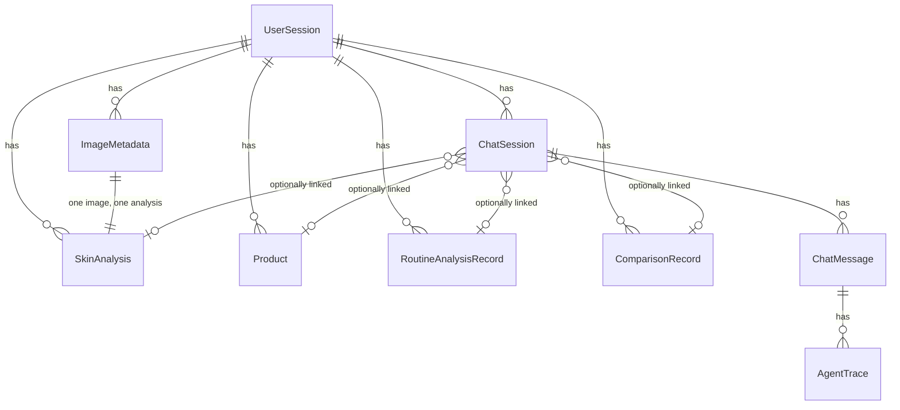

# Application Persistence & Integration (Phase 8)

This document covers what Phase 8 actually added: making the previously
independent Phase 1–7 capabilities work as one coherent, persistent
application. See [docs/history/phase-8-plan.md](history/phase-8-plan.md) for the
approved plan this was built from (kept for history; this document is
the as-built reference).

## The application session model

`UserSession` (Phase 1, `app.models.session`) is the only identity
concept in this app — a plain, anonymous UUID, no auth. Phase 8 makes it
actually usable end-to-end:

```
localStorage["skinvision_session_id"]  (frontend, lib/session.ts)
        |
        v
POST /api/sessions  ->  UserSession row  ->  reused via get_or_create_session
        |
        +--> ImageMetadata / SkinAnalysis   (image upload)
        +--> Product                        (single-product analysis, Ph. 4)
        +--> RoutineAnalysisRecord          (opt-in, Ph. 8)
        +--> ComparisonRecord               (opt-in, Ph. 8)
        +--> ChatSession -> ChatMessage -> AgentTrace  (Ph. 7)
```

A session id is a plain, non-secret UUID, not a credential — see
[Security](#security).

## Database relationships



Two new tables this phase (`RoutineAnalysisRecord`, `ComparisonRecord`),
four new nullable columns on `ChatSession`
(`skin_analysis_id`/`product_id`/`routine_analysis_id`/`comparison_id`),
two new columns on `AgentTrace` from Phase 7
(`success`/`error_message`, for context — not new this phase). Every
other table existed since Phase 1; most (`ChatSession`, `ChatMessage`,
`AgentTrace`, and now `RoutineAnalysisRecord`/`ComparisonRecord`) were
either unused or nonexistent until a later phase actually needed them —
this project adds a table only when a phase has a concrete use for it,
never speculatively.

## Why each persistence decision was made

| Data | Persisted? | Why |
|---|---|---|
| Uploaded image + quality result | Always (Ph. 2) | A user reasonably expects to revisit "the photo I uploaded" |
| Visual analysis result | Always (Ph. 3) | Same result must survive a refresh — recomputing on every visit would also silently hide a real crash (see [Analysis lifecycle](#analysis-lifecycle)) |
| Single-product ingredient analysis | Always (Ph. 4, `Product.analysis_result`) | Established precedent this phase's new persistence mirrors exactly |
| Routine analysis / product comparison | **Opt-in** (`persist: true`, Ph. 8) | Phase 5 deliberately designed these stateless (documented in docs/routine.md) specifically so a client can never submit a forged "already computed" result; defaulting to *always* persisting would quietly reverse that reasoning. Opt-in preserves the default behavior byte-for-byte while still letting a caller who wants a retrievable id ask for one. |
| Chat messages + tool trace | Always (Ph. 7) | The whole point of the agent's trace is to be inspectable later, not just in the response that produced it |
| Chat ↔ analysis/product/routine/comparison linkage | Opt-in (`link`, Ph. 8) | Only meaningful when a chat is actually "about" something specific |

No new normalized tables were introduced purely for having more tables —
`RoutineAnalysisRecord`/`ComparisonRecord` store `request`/`result` as
JSON, mirroring `Product.analysis_result`'s existing, already-established
pattern rather than decomposing either result's internal structure into
new columns.

## API flow

```
Frontend (session_id from localStorage, or freshly created)
    |
    v
POST /api/analysis/upload, /api/products/analyze, /api/routine/analyze,
/api/products/compare, /api/explanations/*, /api/agent/chat
    |
    v
Backend persists (always, or opt-in per the table above)
    |
    v
GET /api/sessions/{id}                  -- session metadata
GET /api/sessions/{id}/analyses         -- this session's analyses
GET /api/sessions/{id}/chats            -- this session's chats
GET /api/analysis/{id}                  -- one analysis, retrieved not recomputed
GET /api/chat/sessions/{id}             -- one chat session's metadata + linkage
GET /api/chat/sessions/{id}/messages    -- full message history + trace
```

Every response uses a dedicated Pydantic schema — no SQLAlchemy model is
ever returned directly (existing convention, unchanged). See
[docs/api.md](api.md) for full request/response shapes.

## Analysis lifecycle

```
image_uploaded  (POST /api/analysis/upload; quality result attached)
      |
      +-- quality rejected --> reported to the client as "quality_rejected"
      |                         (derived, not a 6th stored value -- see below)
      |
      v (quality accepted)
  reported as "ready_for_visual_analysis"
      |
      v (POST /api/analysis/{id}/visual-analysis)
  analyzing  (newly wired this phase -- previously never set)
      |
      +-- any failure --> failed  (newly wired this phase -- previously left
      |                             the row silently stuck at its prior status)
      v success
  completed
```

`GET /api/analysis/{id}` derives its client-facing `status` from
`(SkinAnalysis.status, ImageMetadata.quality_result.is_acceptable)`
(`app.services.analysis_query_service.derive_client_status`) rather than
storing a sixth database value — `image_uploaded` never reaches a
client; it is always reported as one of the two states above instead.
This was a deliberate, approved design choice (see
[docs/history/phase-8-plan.md](history/phase-8-plan.md)'s decision log) over adding new
stored enum values, since the information needed to derive it was
already fully present.

`/results/[id]` now calls `GET /api/analysis/{id}` on mount instead of
unconditionally `POST`-ing `/visual-analysis` every visit — it retrieves
what was already computed, and only triggers the (already-idempotent)
pipeline explicitly via a button when there's actually something to run.

## Chat lifecycle

Unchanged from Phase 7's core loop; two additions:

1. **History survives a refresh.** `chat_session_id` is now persisted to
   `localStorage` (`lib/session.ts`); on mount, `/chat` calls
   `GET /api/chat/sessions/{id}/messages` and hydrates the conversation
   instead of starting empty, even though the message list itself was
   always server-side already (Phase 7) — only the frontend's *knowledge*
   of which conversation to reload was missing.
2. **Trusted linked context.** A chat session may optionally reference
   one existing analysis/product/routine/comparison
   (`AgentChatRequest.link`, applied only when a *new* chat session is
   created). When set, `app.services.agent_service._build_seed_trace`
   loads that row's already-computed, already-validated JSON result and
   injects it into the agent loop as if a tool had already returned it —
   `app.agent.agent.run_agent`'s new `seed_trace` parameter treats it
   exactly like a real executed tool call: included in the trace and in
   `app.agent.validation`'s ground truth from the very first turn. The
   agent never independently reconstructs a fact a deterministic backend
   result already established — see [docs/agent.md](agent.md).

## Frontend: still zero skincare logic

Every Phase 8 frontend addition (`lib/session.ts`, the `ResultsClient`
rewrite, the `/chat` history hydration) only stores, fetches, or renders
already-computed backend state:

- `lib/session.ts` stores/reads a UUID string. It contains no
  conditional logic based on *what* an analysis found — only *whether*
  one exists to fetch.
- `ResultsClient.tsx`'s new status branches (`quality_rejected`,
  `ready_for_visual_analysis`, `analyzing`, `failed`, `completed`) switch
  purely on the string the backend already computed
  (`AnalysisClientStatus`) — the frontend does not itself decide whether
  quality was acceptable or a pipeline run failed.
- `toolSummary.ts`'s `citationsFromTrace` (needed so a message hydrated
  from history renders identically to one just received live) only
  walks already-present `source`/`source_url` fields in an already-
  validated tool trace — it does not decide what counts as a citation,
  synthesize one, or evaluate any skincare fact.

This preserves the invariant stated in `frontend/src/lib/api.ts`'s own
module docstring since Phase 1: no ingredient compatibility, scoring, or
recommendation computation happens in TypeScript, ever.

## Security

- A session/analysis/chat-session id is a plain UUID, not a credential —
  consistent with every other UUID-addressable resource already in this
  app (a product id, an analysis id). No authentication is introduced
  this phase, per its explicit instruction; the threat model (possession
  of an id grants access to that resource) is unchanged from Phase 1–7,
  just applied consistently to the new read endpoints too.
- `GET /api/sessions/{id}` (and the two list endpoints) 404 for an
  unknown id rather than silently creating a new, unrelated session —
  unlike write paths (`get_or_create_session`), a read endpoint that
  names a specific id must never fabricate one.
- `AnalysisDetailResponse` never carries `ImageMetadata.storage_path` or
  any other filesystem detail — enforced by using `ImageMetadataRead`
  (the same schema `POST /api/analysis/upload` already used) rather than
  the ORM row, plus a dedicated test
  (`tests/test_analysis_retrieval.py::test_get_analysis_never_exposes_a_filesystem_path`).
- `AgentChatRequest.link` is validated against the database before use
  (`app.services.agent_service._resolve_link`) — an id that doesn't
  exist is a controlled `400 invalid_chat_link`, never silently ignored
  or treated as if it existed.
- No new secret is ever persisted: `RoutineAnalysisRecord`/
  `ComparisonRecord` store only the deterministic request/result JSON
  already returned to the client; nothing about the agent's linked-
  context injection (§ above) touches provider credentials, and the tool
  registry's exact-name-only dispatch (Phase 7) is untouched by this
  phase's changes.

## Known limitations

- Session/chat/analysis ids grant access to anyone who has them — by
  design (no auth this phase), consistent with every prior phase.
- `AgentChatRequest.link` supports linking a chat only at creation time —
  continuing an existing (unlinked) chat session cannot retroactively
  attach a linkage through this endpoint.
- The frontend did not yet expose a "browse my past analyses/chats" UI
  as of this phase, built on `GET /api/sessions/{id}/analyses`/`.../chats`
  — the endpoints existed and were tested, but no dedicated page was
  built here (kept in scope per the approved plan's "don't optimize for
  feature count"). **Phase 9 later built exactly this** — see the
  History page in [docs/frontend.md](frontend.md).
